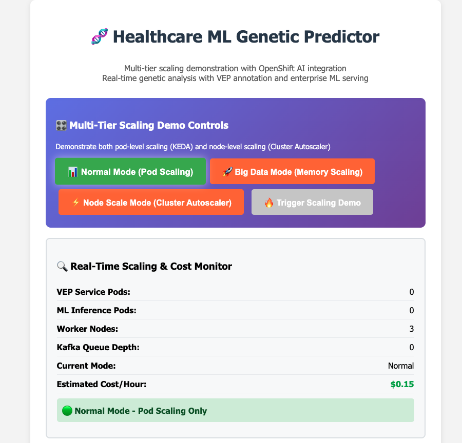
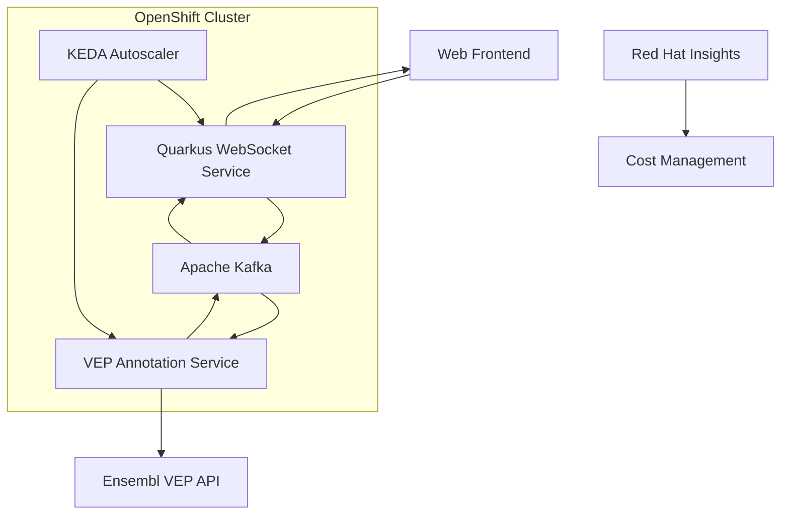

# Healthcare ML Genetic Risk Predictor

A real-time genetic risk prediction system built with Quarkus WebSockets, deployed on Azure Red Hat OpenShift with event-driven architecture and scale-to-zero capabilities.

## 🧬 Overview

This project implements a healthcare ML application that processes genetic data in real-time using WebSocket connections, Kafka event streaming, and machine learning inference. The system is designed for cost-effective deployment on OpenShift with comprehensive monitoring and HIPAA-compliant security.



## 🏗️ Architecture



### Key Components

- **🌐 Quarkus WebSocket Service**: Real-time genetic data processing and session management
- **🔬 VEP Annotation Service**: Genetic variant annotation using Ensembl VEP API
- **📊 Apache Kafka**: Event streaming backbone with multiple topics for different scaling modes
- **⚡ KEDA**: Event-driven autoscaling for both pod and node scaling
- **💰 Red Hat Insights**: Cost management and observability with chargeback capabilities

### Scaling Modes
1. **📊 Normal Mode**: Pod scaling only (genetic-data-raw topic)
2. **🚀 Big Data Mode**: Memory-intensive processing (genetic-bigdata-raw topic)
3. **⚡ Node Scale Mode**: Cluster autoscaler with dedicated compute nodes (genetic-nodescale-raw topic)

## 🚀 Quick Start

### Prerequisites

- **Azure Red Hat OpenShift cluster** with admin access
- **OpenShift CLI (`oc`)** installed and logged in
- **Java 17** (hard requirement for local development)
- **Podman** (preferred over Docker for containerization)
- **Git repository access**

### 🎯 Choose Your Path

#### **🎓 New to the System?**
Start with the [Getting Started Tutorial](./docs/tutorials/01-getting-started.md) for a complete walkthrough.

#### **🚀 Quick Deploy (Experienced Users)**
**📖 For complete deployment instructions, see [DEPLOYMENT.md](DEPLOYMENT.md)**

**✅ Automated Deployment (Recommended):**
```bash
# Clone repository
git clone https://github.com/tosin2013/healthcare-ml-genetic-predictor.git
cd healthcare-ml-genetic-predictor

# Run validated deployment script
./scripts/deploy-clean.sh

# Access application (get URL from script output)
```

**Manual Quick Start:**
```bash
# 1. Clone repository
git clone https://github.com/tosin2013/healthcare-ml-genetic-predictor.git
cd healthcare-ml-genetic-predictor

# 2. Deploy operators
oc apply -k k8s/base/operators

# 3. Deploy infrastructure
oc apply -k k8s/base/infrastructure

# 4. Deploy applications
oc apply -k k8s/base/applications/quarkus-websocket -n healthcare-ml-demo
oc apply -k k8s/base/applications/vep-service -n healthcare-ml-demo

# 5. Grant permissions and start builds
oc policy add-role-to-user system:image-puller system:serviceaccount:healthcare-ml-demo:vep-service -n healthcare-ml-demo
oc start-build quarkus-websocket-service -n healthcare-ml-demo
oc start-build vep-service -n healthcare-ml-demo

# 6. Access application
oc get route quarkus-websocket-service -n healthcare-ml-demo
# Open: https://<route-url>/genetic-client.html
```

## 📁 Project Structure

```
healthcare-ml-genetic-predictor/
├── quarkus-websocket-service/          # Quarkus WebSocket application
│   ├── src/main/java/                  # Java source code
│   ├── src/main/resources/             # Application resources
│   └── pom.xml                         # Maven configuration
├── k8s/                                # OpenShift/Kubernetes manifests
│   ├── base/                           # Base Kustomize resources
│   │   ├── operators/                  # Operator subscriptions
│   │   ├── infrastructure/             # Kafka, namespace
│   │   ├── applications/               # Application deployments
│   │   └── eventing/                   # KEDA, Knative eventing
│   ├── overlays/                       # Environment-specific configs
│   │   ├── dev/                        # Development environment
│   │   ├── staging/                    # Staging environment
│   │   └── prod/                       # Production environment
│   └── components/                     # Reusable components
├── docs/                               # Documentation
├── research.md                         # Technical research notes
└── README.md                           # This file
```

## 🔧 Technology Stack

### Application Layer
- **Quarkus 3.8.6**: Cloud-native Java framework
- **WebSockets**: Real-time genetic data communication
- **SmallRye Reactive Messaging**: Kafka integration
- **Micrometer**: Metrics and monitoring

### Infrastructure Layer
- **Azure Red Hat OpenShift**: Container orchestration
- **AMQ Streams (Kafka)**: Event streaming platform
- **OpenShift Serverless (Knative)**: Scale-to-zero services
- **KEDA**: Event-driven autoscaling
- **OpenShift AI**: ML model serving

### Deployment & Operations
- **Kustomize**: Configuration management
- **OpenShift BuildConfig**: Source-to-Image builds
- **Red Hat Insights**: Cost management
- **Prometheus**: Metrics collection

## 🧪 Testing

### Local Development
```bash
cd quarkus-websocket-service
./mvnw quarkus:dev
```

### WebSocket Testing
Open `http://localhost:8080/genetic-client.html` and test with sample genetic sequences:
- Basic DNA: `ATCGATCGATCG`
- Complex: `ATGCGTACGTAGCTAGCTA`

### Health Checks
```bash
curl http://localhost:8080/q/health
curl http://localhost:8080/q/metrics
```

## 📊 Monitoring & Observability

### Cost Management
- **Red Hat Insights**: Integrated cost tracking
- **Cost Center**: `genomics-research`
- **Project**: `risk-predictor-v1`
- **Billing Model**: Chargeback

### Metrics
- Application metrics via Micrometer/Prometheus
- Kafka metrics for genetic data processing
- KEDA scaling metrics
- Custom healthcare ML metrics

## 🔒 Security & Compliance

### HIPAA Compliance
- Non-root container execution
- Security Context Constraints (SCC)
- Network policies for traffic isolation
- Audit logging enabled

### Security Features
- TLS encryption for all communications
- RBAC for service account permissions
- Secure secrets management
- Container image scanning

## 🌍 Environment Configuration

### Development
- Minimal resource allocation
- Ephemeral storage
- Debug logging enabled
- Single replicas

### Production
- High availability setup
- Persistent storage with backup
- Strict resource limits
- Production monitoring

## 📈 Scaling & Performance

### Scale-to-Zero
- **KEDA**: Kafka lag-based scaling
- **Knative**: HTTP traffic-based scaling
- **Cold Start**: <10 seconds
- **Cost Optimization**: Zero cost when idle

### Performance Targets
- WebSocket connection: <100ms latency
- Genetic sequence processing: <500ms
- Kafka message throughput: 1000 msg/sec
- Concurrent connections: 100+

## 🤝 Contributing

We welcome contributions from the community! This project has many opportunities for enhancement and expansion.

### 🎯 **[Complete Contributing Guide](./CONTRIBUTING.md)** - Comprehensive contribution opportunities

#### High Priority Areas
- **🔥 Red Hat Cost Management Console Access** - Help validate console.redhat.com access
- **📊 Alternative Cost Visualization** - Create local dashboards for cost monitoring
- **🔒 Enhanced Security & Compliance** - Implement healthcare-grade security features
- **🧬 Advanced ML Models** - Expand genetic analysis capabilities

#### Quick Start for Contributors
1. **📖 Read**: [Contributing Guide](./CONTRIBUTING.md) for detailed opportunities
2. **🔍 Browse**: [Open Issues](https://github.com/tosin2013/healthcare-ml-genetic-predictor/issues) for current needs
3. **🚀 Start**: Fork the repository and create a feature branch
4. **✅ Test**: Validate changes locally and on OpenShift
5. **📝 Submit**: Create a pull request with clear description

#### Areas Seeking Contributions
- **Cost Management**: Console access validation and alternative dashboards
- **Security**: HIPAA compliance and healthcare-grade security features
- **ML/AI**: Advanced genetic analysis models and OpenShift AI integration
- **Documentation**: Tutorials, guides, and community resources
- **Performance**: Optimization and advanced scaling configurations
- **Integration**: Multi-cloud deployments and healthcare system integration

## 📚 Documentation

### 🎯 **[Complete Documentation Suite](./docs/README.md)** - Comprehensive Diátaxis framework documentation

#### Quick Access
- **🎓 Tutorials**: [Getting Started](./docs/tutorials/01-getting-started.md) | [Local Development](./docs/tutorials/02-local-development.md)
- **🛠️ How-To Guides**: [Deploy to OpenShift](./docs/how-to/deploy-openshift.md) | [Advanced Troubleshooting](./docs/how-to/advanced-troubleshooting-augment.md)
- **📖 Reference**: [API Reference](./docs/reference/api-reference.md) | [Configuration](./docs/reference/configuration.md)
- **💡 Explanation**: [System Architecture](./docs/explanation/system-architecture.md) | [Scaling Strategy](./docs/explanation/scaling-strategy.md)

#### Component Documentation
- [Quarkus WebSocket Service](./quarkus-websocket-service/README.md) - Threading validation and API endpoints
- [OpenShift Deployment Guide](./k8s/README.md) - Kustomize-based deployment structure
- [Technical Research](./research.md) - Research foundation and ML approaches
- [Development Specification](./dev.spec.md) - Technical specifications and requirements

## 📞 Support

### Getting Help
1. **📚 Documentation**: Start with the [Complete Documentation Suite](./docs/README.md)
2. **🔧 Advanced Troubleshooting**: Use [Context-Aware Debugging Guide](./docs/how-to/advanced-troubleshooting-augment.md)
3. **🧠 Augment Code**: Leverage [AI-Assisted Development Guide](./docs/augment-code-integration-guide.md)
4. **📊 System Logs**: `oc logs -f deployment/quarkus-websocket-service -n healthcare-ml-demo`
5. **⚙️ Configuration**: `kustomize build k8s/base`

### Emergency Response
- **Critical Issues**: Follow [Emergency Response Procedures](./docs/how-to/advanced-troubleshooting-augment.md#emergency-response-procedures)
- **System Recovery**: Use [Recovery Scripts](./scripts/) for automated system restoration
- **Cost Management**: Monitor via [Red Hat Insights Cost Dashboard](./docs/how-to/monitor-costs.md)

## 📄 License

This project is licensed under the Apache License 2.0 - see the LICENSE file for details.

---

**Built with ❤️ for healthcare innovation on Azure Red Hat OpenShift**
