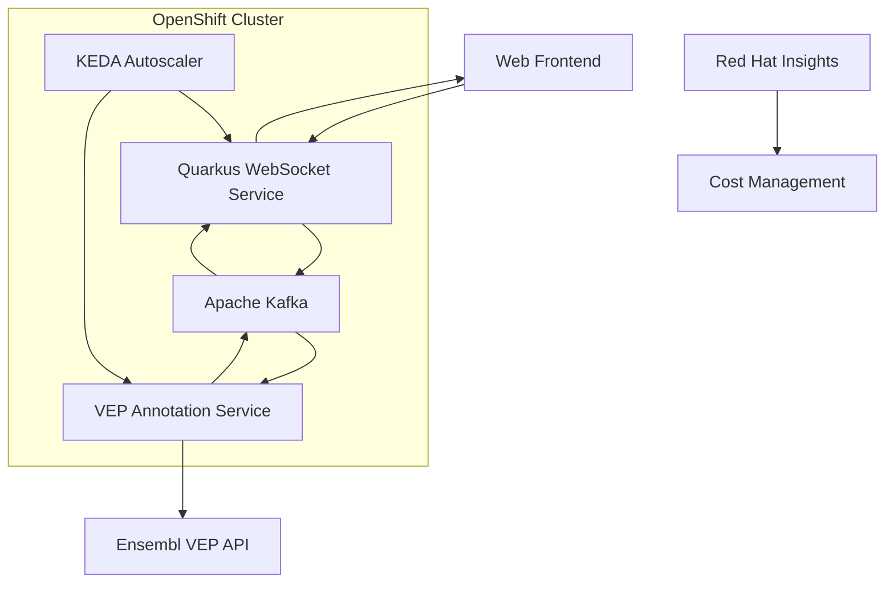

# Healthcare ML Genetic Predictor - Documentation Suite

## 🔗 Quick Navigation
- **🏠 [Main README](../README.md)** - Project overview, quick start, and system status
- **🤝 [Contributing Guide](../CONTRIBUTING.md)** - Comprehensive contribution opportunities and community guidelines
- **📚 [Complete Documentation](#-documentation-types)** - Diátaxis framework documentation below

## 📚 Documentation Framework

This documentation follows the **Diátaxis framework** to provide comprehensive coverage for developers, operators, and users of the Healthcare ML Genetic Prediction system. The documentation is optimized for **Augment Code** environments with context-aware recommendations and AI-assisted development workflows.

## 🎯 Documentation Types

### 🎓 [Tutorials](tutorials/) - Learning-Oriented
Step-by-step learning experiences for beginners:
- [Getting Started Tutorial](tutorials/01-getting-started.md) - Complete setup from zero to running system
- [Local Development Tutorial](tutorials/02-local-development.md) - Setting up local development environment
- [First Genetic Analysis](tutorials/03-first-genetic-analysis.md) - Running your first genetic sequence analysis
- [Scaling Demo Tutorial](tutorials/04-scaling-demo.md) - Understanding pod and node scaling

### 🛠️ [How-To Guides](how-to/) - Task-Oriented
Focused guides for specific tasks and problems:
- [Deploy to OpenShift](how-to/deploy-openshift.md) - Production deployment guide
- [Advanced Troubleshooting](how-to/advanced-troubleshooting-augment.md) - Context-aware debugging with Augment Code
- [Configure KEDA Scaling](how-to/configure-keda.md) - Setting up autoscaling based on current deployment
- [Troubleshoot WebSocket Issues](how-to/troubleshoot-websocket.md) - Common WebSocket problems and solutions
- [Monitor Costs](how-to/monitor-costs.md) - Red Hat Insights cost management and optimization
- [Debug Kafka Flow](how-to/debug-kafka.md) - Kafka message flow debugging and troubleshooting

### 📖 [Reference](reference/) - Information-Oriented
Comprehensive reference materials:
- [API Reference](reference/api-reference.md) - Complete API documentation
- [Configuration Reference](reference/configuration.md) - All configuration options for current deployment
- **Architecture Reference** *(Coming Soon)* - System architecture details
- [Kafka Topics Reference](reference/kafka-topics.md) - Topic schemas and usage for genetic data
- [KEDA Scaling Reference](reference/keda-scaling.md) - Scaling configurations and optimization

### 💡 [Explanation](explanation/) - Understanding-Oriented
Conceptual and architectural documentation:
- [System Architecture](explanation/system-architecture.md) - High-level architecture overview
- [Event-Driven Design](explanation/event-driven-design.md) - Event-driven architecture principles and patterns
- **Scaling Strategy** *(Coming Soon)* - Multi-tier scaling approach
- **Security Model** *(Coming Soon)* - Healthcare-grade security
- **Cost Optimization** *(Coming Soon)* - Cost management strategies

## 🚀 Augment Code Integration

### Context-Aware Features
This documentation is **fully optimized for Augment Code's superior context awareness**:
- **Codebase Integration**: Direct links to relevant code sections with `<augment_code_snippet>` tags
- **AI-Assisted Development**: Patterns that complement Augment's AI features
- **Intelligent Code Analysis**: Leverages Augment's world-leading context engine
- **Advanced Troubleshooting**: Context-aware debugging with intelligent queries

### Enhanced Augment Code Documentation
- 📖 **[Augment Code Integration Guide](augment-code-integration-guide.md)** - Complete Augment optimization guide
- 🔧 **[Advanced Troubleshooting](how-to/advanced-troubleshooting-augment.md)** - Context-aware debugging
- 🧹 **[Code Cleanup Analysis](code-cleanup-analysis-augment.md)** - Environment alignment recommendations
- ✅ **[Quality Assurance Framework](quality-assurance-framework-augment.md)** - Healthcare-grade QA standards

### Quick Navigation for Augment Users
```bash
# Use Augment's codebase retrieval for specific components
# Example queries for Augment Code:
"Show me the WebSocket endpoint implementation for genetic analysis"
"Find KEDA scaling configurations for pod and node scaling"
"Locate VEP service processing logic and API integration"
"Show Kafka topic definitions and consumer group configurations"
"Find threading validation patterns and @Blocking annotations"
"Show me the complete data flow from WebSocket to VEP API"
```

## 🏗️ System Overview

### Architecture at a Glance


### Key Components
- **🌐 Quarkus WebSocket Service**: Real-time genetic data processing and session management
- **🔬 VEP Annotation Service**: Genetic variant annotation using Ensembl VEP API
- **📊 Apache Kafka**: Event-driven messaging backbone with multiple topics
- **⚡ KEDA**: Kubernetes-based autoscaling for pod and node scaling
- **💰 Red Hat Insights**: Cost management and observability

### Current Deployment Status
✅ **Active Components**:
- **Quarkus WebSocket Service**: Running (1 replica, KEDA-managed scaling 1-10)
- **Kafka Cluster**: 3-node cluster with 2 topics (genetic-data-raw, genetic-data-processed)
- **KEDA Autoscaling**: 3 ScaledObjects configured for different services
- **Cost Management**: Red Hat Insights integration with cost attribution labels

⚠️ **Scaling Capabilities**:
- **VEP Service**: Configured but not currently running (scale-to-zero)
- **VEP NodeScale Service**: Configured for cluster autoscaler triggering
- **Cost Attribution**: Automated reporting with genomics-research cost center

## 🎯 Quick Start Paths

### For New Developers
1. Start with [Getting Started Tutorial](tutorials/01-getting-started.md)
2. Follow [Local Development Tutorial](tutorials/02-local-development.md)
3. Review [System Architecture](explanation/system-architecture.md)

### For DevOps Engineers
1. Review [Deploy to OpenShift](how-to/deploy-openshift.md)
2. Use [Advanced Troubleshooting](how-to/advanced-troubleshooting-augment.md) for complex issues
3. Reference [Quality Assurance Framework](quality-assurance-framework-augment.md) for standards

### For Troubleshooting
1. Start with [Advanced Troubleshooting Guide](how-to/advanced-troubleshooting-augment.md)
2. Use [Augment Code Integration Guide](augment-code-integration-guide.md) for context-aware debugging
3. Reference [API Documentation](reference/api-reference.md) for endpoint details

## 📋 Prerequisites

### Development Environment
- **Java 17** (hard requirement for all Quarkus services)
- **Maven** (use project's wrapper: `./mvnw`)
- **Podman** (preferred over Docker)
- **OpenShift CLI** (`oc`)

### OpenShift Cluster Requirements
- **Azure Red Hat OpenShift (ARO)** cluster
- **KEDA operator** installed
- **Strimzi Kafka operator** installed
- **Red Hat Cost Management Metrics Operator** installed

## 🔗 External Resources

### Research Foundation
- [PMC7613081](https://www.ncbi.nlm.nih.gov/pmc/articles/PMC7613081/) - Machine learning approaches for genetic risk prediction
- [Ensembl VEP API](https://rest.ensembl.org/documentation/info/vep_hgvs_post) - Variant Effect Predictor API

### Technology Stack
- [Quarkus](https://quarkus.io/) - Supersonic Subatomic Java
- [Apache Kafka](https://kafka.apache.org/) - Event streaming platform
- [KEDA](https://keda.sh/) - Kubernetes Event-driven Autoscaling
- [OpenShift](https://www.redhat.com/en/technologies/cloud-computing/openshift) - Enterprise Kubernetes platform

## 🎯 GitHub Project Management

### Automated Project Management
- 📋 **[Enhanced GitHub Project Management](github-project-management-enhanced.md)** - Complete project automation setup
- 🎫 **Issue Templates**: Feature requests, bug reports, documentation tasks
- 🤖 **GitHub Actions**: Automated quality checks and project board updates
- 📊 **Metrics Dashboard**: Development velocity and quality tracking

### Project Board Structure
- **Development Workflow**: Code development and review process
- **Documentation Management**: Diátaxis framework compliance tracking
- **Infrastructure & Scaling**: OpenShift and KEDA configuration management
- **Cost Management**: Resource optimization and billing tracking

## 📞 Support and Contribution

### Getting Help
- **📚 Documentation**: Review the appropriate documentation section based on your needs
- **🧠 Augment Code**: Use Augment Code's codebase retrieval for specific implementation details
- **🔧 Troubleshooting**: Check the [advanced troubleshooting guide](how-to/advanced-troubleshooting-augment.md) for complex issues
- **✅ Standards**: Reference the [quality assurance framework](quality-assurance-framework-augment.md) for standards
- **🏠 Main Guide**: See [Main README](../README.md) for project overview and quick start

### Contributing to the Project
- **🤝 [Complete Contributing Guide](../CONTRIBUTING.md)** - Comprehensive contribution opportunities
- **🎯 High Priority Areas**: Cost management console access, security enhancements, ML model expansion
- **🚀 Quick Start**: Fork repository, create feature branch, test changes, submit PR
- **🧠 Augment Workflow**: Follow the [Augment Code integration guide](augment-code-integration-guide.md) for optimal development
- **🔧 Development**: Use project's Maven wrapper (`./mvnw`) and test with Podman
- **☕ Java 17**: Ensure all changes are compatible with Java 17 (hard requirement)
- **✅ Quality**: Follow the [quality assurance framework](quality-assurance-framework-augment.md) standards

---

**🎉 This system successfully demonstrates enterprise-grade healthcare ML processing with real-time scaling capabilities on OpenShift!**
