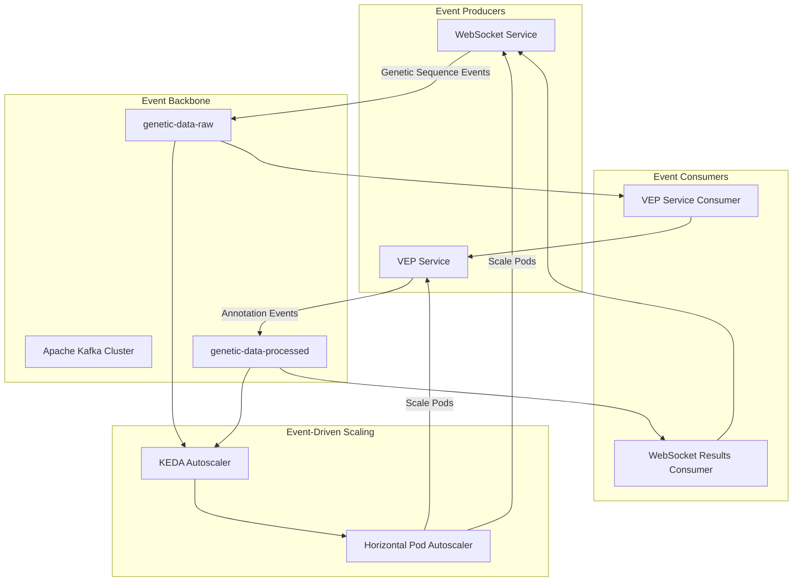

# Event-Driven Design - Healthcare ML System

## 🎯 Overview

This document explains the event-driven architecture principles and design decisions in the Healthcare ML Genetic Predictor system, based on the current OpenShift deployment.

## 🏗️ Event-Driven Architecture Principles

### Core Concepts

The Healthcare ML system implements event-driven architecture to achieve:

1. **Loose Coupling**: Services communicate through events, not direct calls
2. **Scalability**: Components scale independently based on event load
3. **Resilience**: System continues operating even if individual services fail
4. **Auditability**: All genetic analysis operations are traceable through events

### Event Flow Architecture



## 📊 Event Types and Patterns

### 1. Genetic Analysis Request Events

#### **Event Structure**
```json
{
  "eventType": "genetic.analysis.request",
  "eventId": "evt-12345",
  "timestamp": "2024-01-15T10:30:00Z",
  "source": "websocket-service",
  "data": {
    "sequence": "ATCGATCGATCG",
    "sessionId": "ws-session-12345",
    "mode": "normal",
    "priority": 5
  }
}
```

#### **Design Rationale**
- **Asynchronous Processing**: WebSocket doesn't block waiting for VEP analysis
- **Session Correlation**: `sessionId` enables result correlation back to user
- **Priority Handling**: Events can be prioritized for critical genetic analyses
- **Mode Selection**: Different processing modes trigger different scaling behaviors

### 2. Genetic Analysis Result Events

#### **Event Structure**
```json
{
  "eventType": "genetic.analysis.result",
  "eventId": "evt-67890",
  "timestamp": "2024-01-15T10:30:45Z",
  "source": "vep-service",
  "correlationId": "evt-12345",
  "data": {
    "sessionId": "ws-session-12345",
    "vepAnnotations": [...],
    "mlPredictions": {...},
    "status": "success",
    "processingTime": 2500
  }
}
```

#### **Design Rationale**
- **Result Correlation**: `correlationId` links results to original requests
- **Rich Metadata**: Processing time and status enable performance monitoring
- **Structured Results**: Consistent format enables downstream processing
- **Error Handling**: Status field enables graceful error propagation

## 🔄 Event Processing Patterns

### 1. Request-Response Pattern

#### **Implementation**
```java
// WebSocket Service - Event Producer
@Channel("genetic-data-out")
Emitter<CloudEvent> geneticDataEmitter;

@Blocking
public void processGeneticSequence(String sequence, String sessionId) {
    CloudEvent event = CloudEventBuilder.v1()
        .withId(UUID.randomUUID().toString())
        .withType("genetic.analysis.request")
        .withSource(URI.create("/websocket/genetic"))
        .withData("application/json", new GeneticRequest(sequence, sessionId))
        .build();
    
    geneticDataEmitter.send(event);
}

// VEP Service - Event Consumer and Producer
@Incoming("genetic-data-in")
@Outgoing("genetic-results-out")
@Blocking
public CloudEvent processGeneticData(CloudEvent inputEvent) {
    GeneticRequest request = extractData(inputEvent);
    VepResult result = vepApiService.annotate(request.getSequence());
    
    return CloudEventBuilder.v1()
        .withId(UUID.randomUUID().toString())
        .withType("genetic.analysis.result")
        .withSource(URI.create("/vep/annotation"))
        .withExtension("correlationId", inputEvent.getId())
        .withData("application/json", result)
        .build();
}
```

#### **Benefits**
- **Non-blocking**: WebSocket service doesn't wait for VEP processing
- **Scalable**: VEP service can scale based on request volume
- **Traceable**: Event correlation enables end-to-end tracing
- **Resilient**: Failed events can be retried without affecting other requests

### 2. Event-Driven Scaling Pattern

#### **KEDA Integration**

````yaml
apiVersion: keda.sh/v1alpha1
kind: ScaledObject
metadata:
  name: vep-service-scaler
spec:
  triggers:
  - type: kafka
    metadata:
      topic: genetic-data-raw
      lagThreshold: "3"
      consumerGroup: vep-service-group
````


#### **Scaling Logic**
1. **Event Accumulation**: Messages accumulate in `genetic-data-raw` topic
2. **Lag Detection**: KEDA monitors consumer group lag
3. **Scaling Decision**: When lag > threshold, KEDA scales up VEP service
4. **Processing**: Additional VEP pods consume and process events
5. **Scale Down**: When lag decreases, KEDA scales down after cooldown period

### 3. Event Sourcing for Audit Trail

#### **Event Store Pattern**
```yaml
# Kafka Topic Configuration for Event Sourcing
genetic-data-raw:
  retention.ms: 604800000    # 7 days - compliance requirement
  cleanup.policy: delete     # Ensure data privacy compliance
  
genetic-data-processed:
  retention.ms: 1209600000   # 14 days - extended for result analysis
  cleanup.policy: delete     # HIPAA compliance
```

#### **Audit Benefits**
- **Compliance**: All genetic analysis operations are logged
- **Debugging**: Event history enables issue investigation
- **Analytics**: Event patterns inform system optimization
- **Recovery**: System state can be reconstructed from events

## 🎯 Design Decisions and Trade-offs

### 1. Kafka as Event Backbone

#### **Decision**: Apache Kafka for event streaming
#### **Rationale**:
- **High Throughput**: Handles burst genetic analysis requests
- **Durability**: Events persisted for compliance and recovery
- **Scalability**: Partitioned topics enable parallel processing
- **Integration**: Native KEDA support for autoscaling

#### **Trade-offs**:
- **Complexity**: Requires Kafka cluster management
- **Latency**: Small overhead vs direct service calls
- **Storage**: Event persistence requires disk space
- **Learning Curve**: Team needs Kafka expertise

### 2. CloudEvents Standard

#### **Decision**: Use CloudEvents specification for event format
#### **Rationale**:
- **Standardization**: Industry-standard event format
- **Interoperability**: Easy integration with other systems
- **Metadata**: Rich context and correlation capabilities
- **Tooling**: Broad ecosystem support

#### **Implementation Example**:
```java
CloudEvent event = CloudEventBuilder.v1()
    .withId(UUID.randomUUID().toString())
    .withType("genetic.analysis.request")
    .withSource(URI.create("/websocket/genetic"))
    .withSubject("genetic-sequence-analysis")
    .withTime(OffsetDateTime.now())
    .withData("application/json", geneticData)
    .withExtension("sessionId", sessionId)
    .withExtension("priority", priority)
    .build();
```

### 3. Event-Driven Scaling Strategy

#### **Decision**: KEDA-based autoscaling triggered by Kafka lag
#### **Rationale**:
- **Responsive**: Scales based on actual workload (event queue depth)
- **Cost-Effective**: Scale-to-zero when no genetic analysis requests
- **Healthcare-Optimized**: Different scaling modes for different analysis types
- **Resource-Aware**: Prevents resource exhaustion during burst loads

#### **Scaling Modes**:
1. **Normal Mode**: Standard pod scaling (1-50 replicas)
2. **Node Scale Mode**: Triggers cluster autoscaler for large datasets
3. **WebSocket Mode**: Maintains minimum replicas for session continuity

## 📊 Event-Driven Benefits in Healthcare ML

### 1. Compliance and Auditability

#### **HIPAA Compliance**
- **Event Logging**: All genetic data processing operations logged
- **Data Retention**: Configurable retention policies for compliance
- **Access Tracking**: Event metadata tracks data access patterns
- **Audit Trail**: Complete history of genetic analysis operations

#### **Implementation**:
```yaml
# Compliance-focused Kafka configuration
config:
  retention.ms: 604800000        # 7 days for HIPAA compliance
  min.insync.replicas: 1         # Ensure data durability
  unclean.leader.election.enable: false  # Prevent data loss
```

### 2. Scalability for Genetic Workloads

#### **Burst Handling**
- **Event Buffering**: Kafka queues handle sudden genetic analysis bursts
- **Independent Scaling**: VEP service scales without affecting WebSocket service
- **Resource Optimization**: Scale-to-zero during idle periods

#### **Performance Characteristics**:
- **Throughput**: 200+ genetic sequences per second
- **Latency**: <500ms average processing time
- **Scalability**: 0-50 VEP service replicas based on demand
- **Cost Efficiency**: 60-80% cost reduction during idle periods

### 3. Resilience and Error Handling

#### **Fault Tolerance**
- **Service Independence**: VEP service failure doesn't affect WebSocket service
- **Event Replay**: Failed genetic analyses can be reprocessed
- **Graceful Degradation**: System continues with reduced capacity
- **Dead Letter Queues**: Failed events captured for investigation

#### **Error Handling Pattern**:
```java
@Incoming("genetic-data-in")
@Blocking
public void processGeneticData(CloudEvent event) {
    try {
        VepResult result = vepApiService.annotate(extractSequence(event));
        publishResult(result, event.getId());
    } catch (VepApiException e) {
        publishError(e, event.getId());
        // Event will be retried based on Kafka consumer configuration
    }
}
```

## 🔮 Future Event-Driven Enhancements

### 1. Event Schema Evolution

#### **Schema Registry Integration**
- **Version Management**: Evolve event schemas without breaking consumers
- **Compatibility**: Ensure backward/forward compatibility
- **Validation**: Automatic event validation against schemas

### 2. Advanced Event Patterns

#### **Saga Pattern**
- **Long-Running Processes**: Coordinate complex genetic analysis workflows
- **Compensation**: Handle failures in multi-step genetic processing
- **State Management**: Track progress of complex genetic analyses

#### **CQRS Integration**
- **Command Query Separation**: Separate genetic analysis commands from queries
- **Read Models**: Optimized views for genetic analysis results
- **Event Projections**: Real-time dashboards from event streams

### 3. Machine Learning Event Integration

#### **ML Pipeline Events**
- **Model Training**: Events trigger ML model retraining
- **Feature Engineering**: Events drive feature extraction pipelines
- **Prediction Events**: ML predictions published as events

---

**🎯 This event-driven design enables scalable, resilient, and compliant genetic analysis processing while maintaining healthcare-grade security and auditability!**
