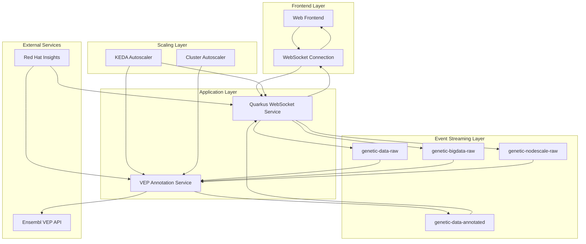
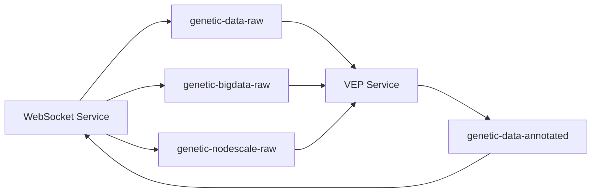
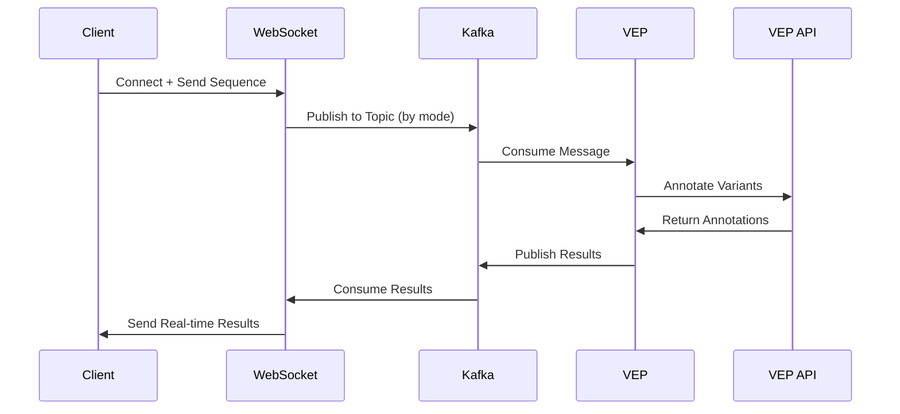
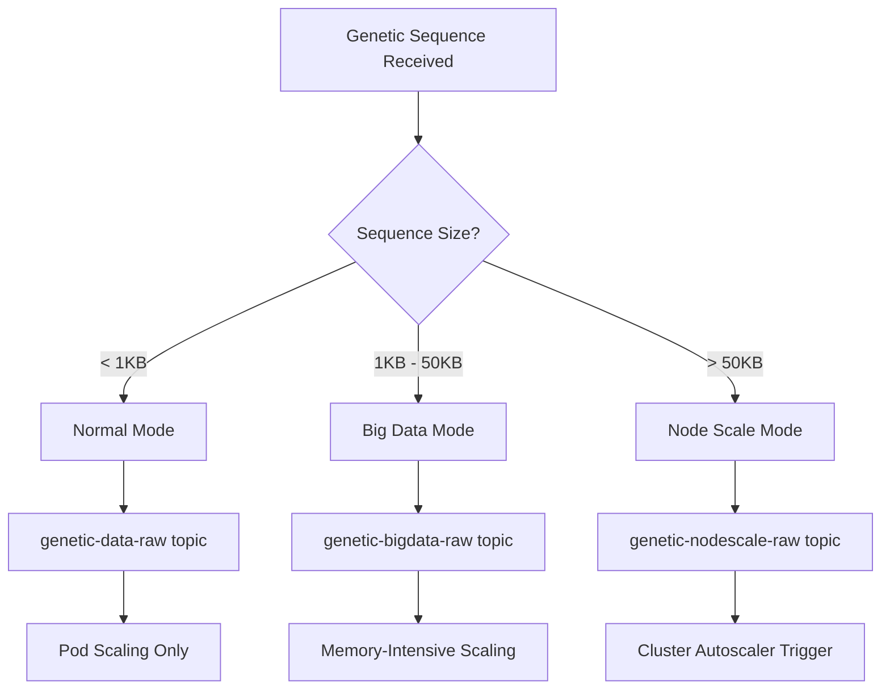

# System Architecture - Healthcare ML Genetic Predictor

## 🎯 Overview

The Healthcare ML Genetic Predictor implements a sophisticated event-driven architecture designed for real-time genetic sequence processing with multi-tier autoscaling capabilities. The system demonstrates enterprise-grade healthcare ML processing on Azure Red Hat OpenShift with cost-effective scale-to-zero operations.

## 🏗️ High-Level Architecture



## 🧩 Core Components

### 1. Quarkus WebSocket Service
**Purpose**: Real-time genetic data processing and session management  
**Technology**: Quarkus 3.8, Java 17, WebSockets, Reactive Messaging  
**Scaling**: Fixed replicas (1-2) for session consistency

<augment_code_snippet path="quarkus-websocket-service/src/main/java/com/redhat/healthcare/GeneticPredictorEndpoint.java" mode="EXCERPT">
````java
@ServerEndpoint("/genetics")
@ApplicationScoped
public class GeneticPredictorEndpoint {
    @Inject
    @Channel("genetic-data-raw-out")
    Emitter<String> geneticDataEmitter;
    
    @Channel("genetic-bigdata-raw-out")
    Emitter<String> geneticBigDataEmitter;
    
    @Channel("genetic-nodescale-raw-out")
    Emitter<String> geneticNodeScaleEmitter;
````
</augment_code_snippet>

**Key Responsibilities**:
- WebSocket session management with 15-minute timeouts
- Multi-topic Kafka message routing based on scaling mode
- Real-time result delivery to connected clients
- API endpoint exposure for different scaling modes

### 2. VEP Annotation Service
**Purpose**: Genetic variant annotation using Ensembl VEP API  
**Technology**: Quarkus 3.8, Java 17, Reactive Programming, REST Client  
**Scaling**: KEDA-managed (0-10 replicas based on Kafka lag)

<augment_code_snippet path="vep-service/src/main/java/com/redhat/healthcare/vep/VepAnnotationService.java" mode="EXCERPT">
````java
@ApplicationScoped
public class VepAnnotationService {
    @Incoming("genetic-nodescale-raw")
    @Outgoing("genetic-data-annotated")
    public Uni<String> processGeneticSequence(String cloudEventJson) {
        return Uni.createFrom().item(() -> {
            // VEP processing on worker thread
            VepAnnotationResult vepResult = annotateWithVep(sequenceData);
            return vepResult;
        }).runSubscriptionOn(Infrastructure.getDefaultExecutor())
````
</augment_code_snippet>

**Key Responsibilities**:
- Kafka message consumption from multiple topics
- HGVS notation conversion for genetic sequences
- Ensembl VEP API integration with caching
- CloudEvent-based result publishing

### 3. Apache Kafka Event Streaming
**Purpose**: Event-driven messaging backbone  
**Technology**: Strimzi Kafka 3.x on OpenShift  
**Topics**: Four specialized topics for different scaling modes

#### Topic Architecture


**Topic Specifications**:
- `genetic-data-raw`: Normal mode processing (3 partitions, 7-day retention)
- `genetic-bigdata-raw`: Memory-intensive processing (3 partitions, 14-day retention)
- `genetic-nodescale-raw`: Node scaling triggers (3 partitions, 7-day retention)
- `genetic-data-annotated`: Processed results (3 partitions, 14-day retention)

### 4. KEDA Autoscaling
**Purpose**: Event-driven autoscaling based on Kafka lag  
**Technology**: KEDA 2.x with Kafka scalers  
**Scaling Modes**: Three distinct scaling behaviors

<augment_code_snippet path="k8s/base/keda/multi-topic-scaledobjects.yaml" mode="EXCERPT">
````yaml
apiVersion: keda.sh/v1alpha1
kind: ScaledObject
metadata:
  name: vep-service-normal-scaler
spec:
  scaleTargetRef:
    kind: Deployment
    name: vep-service
  minReplicaCount: 0
  maxReplicaCount: 3
  triggers:
  - type: kafka
    metadata:
      topic: genetic-data-raw
      lagThreshold: "3"
````
</augment_code_snippet>

## 🔄 Data Flow Architecture

### 1. Request Processing Flow


### 2. Scaling Decision Flow


## 🎯 Design Principles

### 1. Event-Driven Architecture
**Principle**: Loose coupling through asynchronous messaging  
**Implementation**: Kafka-based event streaming with CloudEvents format  
**Benefits**: 
- Resilient to service failures
- Independent scaling of components
- Audit trail of all genetic processing events

### 2. Reactive Programming
**Principle**: Non-blocking, asynchronous processing  
**Implementation**: Quarkus Reactive Messaging with Mutiny  
**Benefits**:
- High throughput with low resource usage
- Proper thread management (worker vs event loop)
- Backpressure handling for large genetic datasets

### 3. Scale-to-Zero Capability
**Principle**: Cost optimization through dynamic scaling  
**Implementation**: KEDA with Kafka lag-based scaling  
**Benefits**:
- Zero cost during idle periods
- Automatic scaling based on actual demand
- Resource efficiency for variable workloads

### 4. Multi-Tier Scaling Strategy
**Principle**: Different scaling behaviors for different workload types  
**Implementation**: Three scaling modes with dedicated Kafka topics  
**Benefits**:
- Optimized resource allocation
- Predictable scaling behavior
- Cost attribution by workload type

## 🔧 Technical Architecture Decisions

### ADR-001: Event-Driven Architecture with Kafka
**Decision**: Use Apache Kafka for event streaming between services  
**Rationale**: 
- Decouples services for independent scaling
- Provides durability and replay capabilities
- Enables audit trails for healthcare compliance

**Implementation**:
- Strimzi Kafka operator for OpenShift
- CloudEvents format for message standardization
- Topic-based routing for scaling modes

### ADR-002: KEDA-Based Autoscaling
**Decision**: Use KEDA for event-driven autoscaling  
**Rationale**:
- Native Kubernetes integration
- Kafka lag-based scaling metrics
- Scale-to-zero capability

**Implementation**:
- Separate ScaledObjects for each scaling mode
- Kafka consumer group lag as scaling trigger
- Different scaling parameters per mode

### ADR-003: WebSocket Session Management
**Decision**: Single WebSocket service instance for session consistency  
**Rationale**:
- Prevents session conflicts across replicas
- Simplifies real-time result delivery
- Maintains connection state integrity

**Implementation**:
- Fixed replica count (1-2) for WebSocket service
- Session ID mapping between API and WebSocket
- 15-minute session timeout with keepalive

## 🏥 Healthcare-Specific Considerations

### 1. Data Privacy and Security
- **Encryption**: TLS termination at OpenShift routes
- **Data Retention**: Configurable retention policies per topic
- **Audit Logging**: Complete processing trail in Kafka
- **Access Control**: OpenShift RBAC integration

### 2. Compliance Requirements
- **HIPAA Readiness**: Secure data handling patterns
- **Audit Trails**: Immutable event logs in Kafka
- **Data Lineage**: CloudEvent metadata tracking
- **Error Handling**: Comprehensive error logging

### 3. Reliability and Availability
- **Circuit Breakers**: VEP API failure handling
- **Retry Logic**: Configurable retry policies
- **Health Checks**: Comprehensive health endpoints
- **Graceful Degradation**: Fallback processing modes

## 💰 Cost Optimization Architecture

### 1. Resource Attribution
- **Cost Labels**: Comprehensive labeling strategy
- **Project Tracking**: Red Hat Insights integration
- **Resource Monitoring**: Per-service cost tracking

### 2. Scaling Efficiency
- **Scale-to-Zero**: Automatic resource deallocation
- **Right-Sizing**: Mode-specific resource limits
- **Node Affinity**: Dedicated compute nodes for intensive workloads

### 3. Operational Efficiency
- **GitOps Deployment**: Automated infrastructure management
- **BuildConfig Integration**: Streamlined CI/CD pipeline
- **Monitoring Integration**: Prometheus metrics collection

## 🔮 Future Architecture Evolution

### 1. Machine Learning Integration
- **OpenShift AI**: Native ML model serving
- **Model Versioning**: A/B testing capabilities
- **Feature Store**: Centralized feature management

### 2. Advanced Scaling
- **Predictive Scaling**: ML-based demand forecasting
- **Multi-Cloud**: Cross-cloud resource optimization
- **Edge Computing**: Distributed processing nodes

### 3. Enhanced Security
- **Confidential Containers**: Encrypted runtime environments
- **Zero Trust**: Network-level security policies
- **Federated Identity**: Enterprise SSO integration

---

**🎯 This architecture successfully demonstrates enterprise-grade healthcare ML processing with real-time scaling capabilities, providing a foundation for production healthcare applications on OpenShift.**
