# Separation of Concerns Validation Strategy

## Overview

This document explains how we prevent developers from accidentally breaking the critical separation of concerns between the 4 scaling mode buttons and their corresponding Kafka topics before code reaches OpenShift.

## 🎯 Problem Statement

The Healthcare ML Genetic Predictor has 4 distinct scaling modes that must remain completely separated:

1. **📊 Normal Mode** → `genetic-data-raw` topic → Standard pod scaling
2. **🚀 Big Data Mode** → `genetic-bigdata-raw` topic → Memory-intensive scaling  
3. **⚡ Node Scale Mode** → `genetic-nodescale-raw` topic → Cluster autoscaler
4. **🔄 Kafka Lag Mode** → `genetic-lag-demo-raw` topic → KEDA consumer lag scaling

**Breaking this separation could cause**:
- Cross-mode interference (e.g., normal mode triggering big data scaling)
- Resource allocation conflicts
- Incorrect cost attribution
- KEDA scaler conflicts
- Consumer group collisions

## 🛡️ Validation Strategy

### 1. Pre-Merge GitHub Actions Workflow

**File**: `.github/workflows/separation-of-concerns-validation.yml`

This workflow runs on every PR and push to main, validating:

#### UI Button Validation
- ✅ All 4 button IDs exist: `normalModeBtn`, `bigDataModeBtn`, `nodeScaleModeBtn`, `kafkaLagModeBtn`
- ✅ All 4 button functions exist: `setNormalMode()`, `setBigDataMode()`, `setNodeScaleMode()`, `setKafkaLagMode()`
- ✅ Button text labels remain consistent
- ✅ Mode variable assignments are correct

#### Kafka Topic Validation
- ✅ All required topics are defined in k8s manifests
- ✅ Topic configurations are present and valid
- ✅ No topic names have been changed or removed

#### WebSocket Service Routing
- ✅ Mode-based routing logic exists in Java code
- ✅ Topic routing references are correct
- ✅ No cross-contamination between modes

#### KEDA ScaledObject Validation
- ✅ KEDA scalers exist for genetic topics
- ✅ Different lag thresholds maintain separation
- ✅ Consumer groups don't conflict

#### VEP Service Consumer Groups
- ✅ Separate consumer groups for each mode
- ✅ No consumer group naming conflicts
- ✅ Proper @Incoming annotations

#### UI Regression Test Coverage
- ✅ Test script includes all 4 modes
- ✅ Test script syntax is valid
- ✅ Expected responses are defined for each mode

### 2. Local Validation Script

**File**: `scripts/validate-separation-of-concerns.sh`

Developers can run this locally before committing:

```bash
./scripts/validate-separation-of-concerns.sh
```

This script performs the same validations as the GitHub Actions workflow but provides immediate feedback during development.

### 3. Cross-Contamination Detection

The validation specifically checks for cross-contamination:

- **Normal mode functions** don't reference other mode topics
- **KEDA scalers** don't have conflicting consumer groups
- **JavaScript mode assignments** are unique and correct
- **Documentation consistency** across all modes

## 🚨 Failure Scenarios

The validation will **fail the PR** if developers:

### Break UI Button Separation
```javascript
// ❌ WRONG: Normal mode function references big data topic
function setNormalMode() {
    currentMode = 'normal';
    // This would fail validation:
    sendToTopic('genetic-bigdata-raw');
}
```

### Change Topic Names
```yaml
# ❌ WRONG: Changing topic name breaks separation
apiVersion: kafka.strimzi.io/v1beta2
kind: KafkaTopic
metadata:
  name: genetic-data-combined  # Should be genetic-data-raw
```

### Create Consumer Group Conflicts
```yaml
# ❌ WRONG: Same consumer group for different modes
triggers:
- type: kafka
  metadata:
    consumerGroup: vep-service-group  # Should be unique per mode
    topic: genetic-bigdata-raw
```

### Remove KEDA Scalers
```yaml
# ❌ WRONG: Removing a required ScaledObject
# Missing: vep-service-nodescale-scaler
```

## ✅ Validation Success Criteria

For validation to pass, ALL of the following must be true:

### UI Layer
- [ ] 4 unique button IDs exist
- [ ] 4 unique JavaScript functions exist  
- [ ] Mode assignments are correct
- [ ] No cross-references between modes

### Kafka Layer
- [ ] 5 required topics are defined (4 input + 1 output)
- [ ] Topic configurations are valid
- [ ] No topic name changes

### Service Layer
- [ ] WebSocket service has mode routing logic
- [ ] VEP services have separate consumer groups
- [ ] No consumer group conflicts

### KEDA Layer
- [ ] ScaledObjects exist for all genetic topics
- [ ] Lag thresholds provide proper separation
- [ ] Consumer groups are unique

### Testing Layer
- [ ] UI regression test covers all 4 modes
- [ ] Test syntax is valid
- [ ] Expected responses are defined

## 🔧 How to Fix Validation Failures

### If UI Validation Fails:
1. Check button IDs in `index.html`
2. Verify JavaScript function names
3. Ensure mode assignments are correct

### If Topic Validation Fails:
1. Check k8s topic manifests
2. Verify topic names match expected values
3. Ensure all 5 topics are defined

### If Routing Validation Fails:
1. Check WebSocket service Java code
2. Verify topic routing logic
3. Ensure mode constants are defined

### If KEDA Validation Fails:
1. Check ScaledObject definitions
2. Verify consumer group uniqueness
3. Ensure genetic topics are referenced

### If Test Validation Fails:
1. Check `scripts/test-ui-regression.js`
2. Verify all 4 modes are tested
3. Fix any syntax errors

## 🎯 Benefits

This validation strategy ensures:

1. **🛡️ Protection**: Prevents accidental breaking changes
2. **🚀 Confidence**: Developers can confidently make changes
3. **📊 Visibility**: Clear feedback on what's broken
4. **🔄 Automation**: No manual validation required
5. **📝 Documentation**: Automatically generates reports

## 🔄 Workflow Integration

The validation runs:

- **On every PR**: Prevents merge of breaking changes
- **On push to main**: Catches any issues that slip through
- **Locally**: Developers can validate before pushing
- **In parallel**: Doesn't slow down other CI/CD processes

## 📊 Reporting

When validation runs, it generates:

- **GitHub PR comments** with detailed results
- **Artifact reports** for debugging
- **Clear pass/fail status** for each validation area
- **Specific fix instructions** for failures

## 🎭 Example Validation Flow

```mermaid
graph TD
    A[Developer commits code] --> B[GitHub Actions triggered]
    B --> C[UI Button Validation]
    C --> D[Kafka Topic Validation]
    D --> E[WebSocket Routing Validation]
    E --> F[KEDA Scaler Validation]
    F --> G[VEP Consumer Group Validation]
    G --> H[Test Coverage Validation]
    H --> I{All validations pass?}
    I -->|Yes| J[✅ PR can be merged]
    I -->|No| K[❌ PR blocked with detailed report]
    K --> L[Developer fixes issues]
    L --> A
```



## 📋 Checklist for Developers

Before making changes that affect scaling modes:

- [ ] Run `./scripts/validate-separation-of-concerns.sh` locally
- [ ] Ensure all 4 scaling modes still work
- [ ] Update tests if adding new functionality
- [ ] Check documentation consistency
- [ ] Verify no cross-mode references

---

**🛡️ This validation strategy ensures the 4-mode scaling architecture remains robust and maintainable while allowing confident development iterations.**
