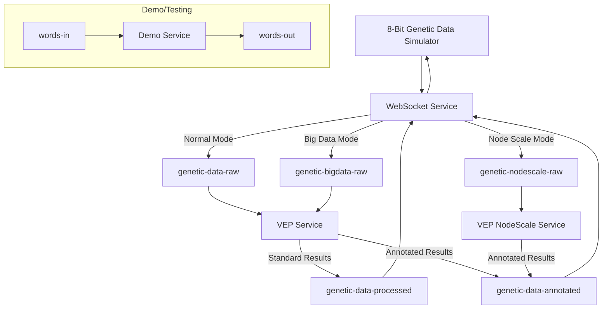

# Kafka Topics Reference - Healthcare ML System

## 🎯 Overview

This reference provides comprehensive details about Kafka topics in the Healthcare ML Genetic Predictor system based on the current OpenShift deployment.

## 📊 Current Topic Architecture

### Topic Overview

```bash
# List all topics in the cluster
oc exec -it genetic-data-cluster-kafka-0 -n healthcare-ml-demo -- \
  bin/kafka-topics.sh --bootstrap-server localhost:9092 --list

# Current topics (7 total):
# - genetic-data-raw          (Normal mode input)
# - genetic-data-processed    (Standard processing results)
# - genetic-data-annotated    (VEP annotated results)
# - genetic-bigdata-raw       (Big data mode input)
# - genetic-nodescale-raw     (Node scaling mode input)
# - words-in                  (Demo/testing input)
# - words-out                 (Demo/testing output)
```

### Data Flow Architecture



## 📝 Topic Specifications

### genetic-data-raw

#### **Purpose**
Input topic for raw genetic sequence data from the WebSocket frontend.

#### **Configuration**
```yaml
apiVersion: kafka.strimzi.io/v1beta2
kind: KafkaTopic
metadata:
  name: genetic-data-raw
  namespace: healthcare-ml-demo
  labels:
    strimzi.io/cluster: genetic-data-cluster
    cost-center: "genomics-research"
    project: "risk-predictor-v1"
    topic-type: "input"
    data-classification: "genetic-raw"
spec:
  partitions: 3
  replicas: 1
  config:
    retention.ms: 604800000      # 7 days
    retention.bytes: 1073741824  # 1GB per partition
    segment.ms: 86400000         # 1 day
    segment.bytes: 134217728     # 128MB
    cleanup.policy: delete
    compression.type: snappy
    min.insync.replicas: 1
    unclean.leader.election.enable: false
    max.message.bytes: 1048576   # 1MB
```

#### **Message Schema**
```json
{
  "type": "object",
  "properties": {
    "sequence": {
      "type": "string",
      "description": "Raw genetic sequence (DNA/RNA)",
      "pattern": "^[ATCGN]+$",
      "maxLength": 1000000
    },
    "sessionId": {
      "type": "string",
      "description": "WebSocket session identifier",
      "pattern": "^[a-zA-Z0-9-_]+$"
    },
    "timestamp": {
      "type": "string",
      "format": "date-time",
      "description": "Request timestamp in ISO 8601 format"
    },
    "mode": {
      "type": "string",
      "enum": ["normal", "bigdata", "nodescale"],
      "description": "Processing mode for scaling behavior"
    },
    "metadata": {
      "type": "object",
      "properties": {
        "userId": {"type": "string"},
        "analysisType": {"type": "string"},
        "priority": {"type": "integer", "minimum": 1, "maximum": 10}
      }
    }
  },
  "required": ["sequence", "sessionId", "timestamp"]
}
```

#### **Example Message**
```json
{
  "sequence": "ATCGATCGATCGTAGCTAGCTA",
  "sessionId": "ws-session-12345",
  "timestamp": "2024-01-15T10:30:00Z",
  "mode": "normal",
  "metadata": {
    "userId": "user-789",
    "analysisType": "variant-annotation",
    "priority": 5
  }
}
```

#### **Producers**
- **quarkus-websocket-service**: Main producer from WebSocket frontend
- **Consumer Group**: N/A (producer only)

#### **Consumers**
- **vep-service**: Consumer group `vep-service-group`
- **vep-service-nodescale**: Consumer group `vep-nodescale-service-group`

### genetic-data-processed

#### **Purpose**
Output topic for processed genetic data with VEP annotations and ML analysis results.

#### **Configuration**
```yaml
apiVersion: kafka.strimzi.io/v1beta2
kind: KafkaTopic
metadata:
  name: genetic-data-processed
  namespace: healthcare-ml-demo
  labels:
    strimzi.io/cluster: genetic-data-cluster
    cost-center: "genomics-research"
    project: "risk-predictor-v1"
    topic-type: "output"
    data-classification: "genetic-processed"
spec:
  partitions: 3
  replicas: 1
  config:
    retention.ms: 1209600000     # 14 days
    retention.bytes: 2147483648  # 2GB per partition
    segment.ms: 86400000         # 1 day
    segment.bytes: 134217728     # 128MB
    cleanup.policy: delete
    compression.type: snappy
    min.insync.replicas: 1
    unclean.leader.election.enable: false
    max.message.bytes: 2097152   # 2MB (larger for results)
```

#### **Message Schema**
```json
{
  "type": "object",
  "properties": {
    "sessionId": {
      "type": "string",
      "description": "Original WebSocket session identifier"
    },
    "originalSequence": {
      "type": "string",
      "description": "Original genetic sequence"
    },
    "timestamp": {
      "type": "string",
      "format": "date-time",
      "description": "Processing completion timestamp"
    },
    "processingTime": {
      "type": "number",
      "description": "Processing time in milliseconds"
    },
    "vepAnnotations": {
      "type": "array",
      "items": {
        "type": "object",
        "properties": {
          "variant": {"type": "string"},
          "consequence": {"type": "string"},
          "impact": {"type": "string"},
          "gene": {"type": "string"},
          "transcript": {"type": "string"}
        }
      }
    },
    "mlPredictions": {
      "type": "object",
      "properties": {
        "riskScore": {"type": "number", "minimum": 0, "maximum": 1},
        "confidence": {"type": "number", "minimum": 0, "maximum": 1},
        "classification": {"type": "string"},
        "features": {"type": "array", "items": {"type": "string"}}
      }
    },
    "status": {
      "type": "string",
      "enum": ["success", "error", "partial"],
      "description": "Processing status"
    },
    "errors": {
      "type": "array",
      "items": {
        "type": "object",
        "properties": {
          "code": {"type": "string"},
          "message": {"type": "string"},
          "severity": {"type": "string"}
        }
      }
    }
  },
  "required": ["sessionId", "originalSequence", "timestamp", "status"]
}
```

#### **Example Message**
```json
{
  "sessionId": "ws-session-12345",
  "originalSequence": "ATCGATCGATCGTAGCTAGCTA",
  "timestamp": "2024-01-15T10:30:45Z",
  "processingTime": 2500,
  "vepAnnotations": [
    {
      "variant": "rs123456",
      "consequence": "missense_variant",
      "impact": "MODERATE",
      "gene": "BRCA1",
      "transcript": "ENST00000357654"
    }
  ],
  "mlPredictions": {
    "riskScore": 0.75,
    "confidence": 0.89,
    "classification": "high-risk",
    "features": ["variant_frequency", "conservation_score", "protein_impact"]
  },
  "status": "success",
  "errors": []
}
```

#### **Producers**
- **vep-service**: Main producer after VEP annotation
- **vep-service-nodescale**: Producer for node-scale processing

#### **Consumers**
- **quarkus-websocket-service**: Consumer group `websocket-results-service-group`

### genetic-data-annotated

#### **Purpose**
VEP-annotated genetic data with detailed variant analysis results for WebSocket frontend display.

#### **Configuration**
```yaml
apiVersion: kafka.strimzi.io/v1beta2
kind: KafkaTopic
metadata:
  name: genetic-data-annotated
  namespace: healthcare-ml-demo
  labels:
    strimzi.io/cluster: genetic-data-cluster
    cost-center: "genomics-research"
    project: "risk-predictor-v1"
    topic-type: "annotated-output"
    data-classification: "genetic-annotated"
spec:
  partitions: 3
  replicas: 1
  config:
    retention.ms: 1209600000     # 14 days
    retention.bytes: 2147483648  # 2GB per partition
    segment.ms: 86400000         # 1 day
    segment.bytes: 134217728     # 128MB
    cleanup.policy: delete
    compression.type: snappy
    min.insync.replicas: 1
    unclean.leader.election.enable: false
    max.message.bytes: 2097152   # 2MB (larger for VEP annotations)
```

#### **Producers**
- **vep-service**: Main producer after VEP annotation
- **vep-service-nodescale**: Producer for node-scale VEP processing

#### **Consumers**
- **quarkus-websocket-service**: Consumer group `websocket-results-service-group`

### genetic-bigdata-raw

#### **Purpose**
Input topic for large genetic datasets that require memory-intensive processing.

#### **Configuration**
```yaml
apiVersion: kafka.strimzi.io/v1beta2
kind: KafkaTopic
metadata:
  name: genetic-bigdata-raw
  namespace: healthcare-ml-demo
  labels:
    strimzi.io/cluster: genetic-data-cluster
    cost-center: "genomics-research"
    project: "risk-predictor-v1"
    topic-type: "bigdata-input"
    data-classification: "genetic-bigdata"
spec:
  partitions: 6               # More partitions for big data
  replicas: 1
  config:
    retention.ms: 604800000      # 7 days
    retention.bytes: 5368709120  # 5GB per partition (larger for big data)
    segment.ms: 86400000         # 1 day
    segment.bytes: 268435456     # 256MB (larger segments)
    cleanup.policy: delete
    compression.type: snappy
    min.insync.replicas: 1
    unclean.leader.election.enable: false
    max.message.bytes: 10485760  # 10MB (much larger for big datasets)
```

#### **Producers**
- **quarkus-websocket-service**: When mode="bigdata"

#### **Consumers**
- **vep-service**: Consumer group `vep-bigdata-service-group`

### genetic-nodescale-raw

#### **Purpose**
Input topic for genetic datasets that trigger cluster autoscaler for additional compute nodes.

#### **Configuration**
```yaml
apiVersion: kafka.strimzi.io/v1beta2
kind: KafkaTopic
metadata:
  name: genetic-nodescale-raw
  namespace: healthcare-ml-demo
  labels:
    strimzi.io/cluster: genetic-data-cluster
    cost-center: "genomics-research"
    project: "risk-predictor-v1"
    topic-type: "nodescale-input"
    data-classification: "genetic-nodescale"
spec:
  partitions: 3
  replicas: 1
  config:
    retention.ms: 604800000      # 7 days
    retention.bytes: 2147483648  # 2GB per partition
    segment.ms: 86400000         # 1 day
    segment.bytes: 134217728     # 128MB
    cleanup.policy: delete
    compression.type: snappy
    min.insync.replicas: 1
    unclean.leader.election.enable: false
    max.message.bytes: 5242880   # 5MB (large for compute-intensive processing)
```

#### **Producers**
- **quarkus-websocket-service**: When mode="nodescale"

#### **Consumers**
- **vep-service-nodescale**: Consumer group `vep-nodescale-service-group`

### words-in

#### **Purpose**
Demo/testing input topic for word processing demonstrations and system validation.

#### **Configuration**
```yaml
apiVersion: kafka.strimzi.io/v1beta2
kind: KafkaTopic
metadata:
  name: words-in
  namespace: healthcare-ml-demo
  labels:
    strimzi.io/cluster: genetic-data-cluster
    cost-center: "genomics-research"
    project: "risk-predictor-v1"
    topic-type: "demo-input"
    data-classification: "demo-testing"
spec:
  partitions: 3
  replicas: 1
  config:
    retention.ms: 604800000      # 7 days
    retention.bytes: 1073741824  # 1GB per partition
    segment.ms: 86400000         # 1 day
    segment.bytes: 134217728     # 128MB
    cleanup.policy: delete
    compression.type: snappy
    min.insync.replicas: 1
    unclean.leader.election.enable: false
    max.message.bytes: 1048576   # 1MB
```

#### **Message Schema**
```json
{
  "type": "object",
  "properties": {
    "word": {
      "type": "string",
      "description": "Input word for processing",
      "maxLength": 1000
    },
    "sessionId": {
      "type": "string",
      "description": "Demo session identifier",
      "pattern": "^[a-zA-Z0-9-_]+$"
    },
    "timestamp": {
      "type": "string",
      "format": "date-time",
      "description": "Request timestamp in ISO 8601 format"
    },
    "processingType": {
      "type": "string",
      "enum": ["uppercase", "lowercase", "reverse", "count"],
      "description": "Type of word processing to perform"
    },
    "metadata": {
      "type": "object",
      "properties": {
        "testId": {"type": "string"},
        "batchId": {"type": "string"}
      }
    }
  },
  "required": ["word", "sessionId", "timestamp", "processingType"]
}
```

#### **Example Message**
```json
{
  "word": "healthcare",
  "sessionId": "demo-session-456",
  "timestamp": "2024-01-15T10:30:00Z",
  "processingType": "uppercase",
  "metadata": {
    "testId": "test-123",
    "batchId": "batch-789"
  }
}
```

#### **Producers**
- **Demo services**: Testing and validation components
- **Load testing tools**: Performance validation scripts

#### **Consumers**
- **Demo word processor**: Consumer group `demo-processor-group`

### words-out

#### **Purpose**
Demo/testing output topic for processed word results and system validation.

#### **Configuration**
```yaml
apiVersion: kafka.strimzi.io/v1beta2
kind: KafkaTopic
metadata:
  name: words-out
  namespace: healthcare-ml-demo
  labels:
    strimzi.io/cluster: genetic-data-cluster
    cost-center: "genomics-research"
    project: "risk-predictor-v1"
    topic-type: "demo-output"
    data-classification: "demo-testing"
spec:
  partitions: 3
  replicas: 1
  config:
    retention.ms: 604800000      # 7 days
    retention.bytes: 1073741824  # 1GB per partition
    segment.ms: 86400000         # 1 day
    segment.bytes: 134217728     # 128MB
    cleanup.policy: delete
    compression.type: snappy
    min.insync.replicas: 1
    unclean.leader.election.enable: false
    max.message.bytes: 1048576   # 1MB
```

#### **Message Schema**
```json
{
  "type": "object",
  "properties": {
    "sessionId": {
      "type": "string",
      "description": "Original demo session identifier"
    },
    "originalWord": {
      "type": "string",
      "description": "Original input word"
    },
    "processedWord": {
      "type": "string",
      "description": "Processed word result"
    },
    "timestamp": {
      "type": "string",
      "format": "date-time",
      "description": "Processing completion timestamp"
    },
    "processingTime": {
      "type": "number",
      "description": "Processing time in milliseconds"
    },
    "processingType": {
      "type": "string",
      "description": "Type of processing performed"
    },
    "status": {
      "type": "string",
      "enum": ["success", "error"],
      "description": "Processing status"
    },
    "metadata": {
      "type": "object",
      "properties": {
        "testId": {"type": "string"},
        "batchId": {"type": "string"},
        "processorVersion": {"type": "string"}
      }
    }
  },
  "required": ["sessionId", "originalWord", "processedWord", "timestamp", "status"]
}
```

#### **Example Message**
```json
{
  "sessionId": "demo-session-456",
  "originalWord": "healthcare",
  "processedWord": "HEALTHCARE",
  "timestamp": "2024-01-15T10:30:02Z",
  "processingTime": 15,
  "processingType": "uppercase",
  "status": "success",
  "metadata": {
    "testId": "test-123",
    "batchId": "batch-789",
    "processorVersion": "1.0.0"
  }
}
```

#### **Producers**
- **Demo word processor**: Main producer after word processing

#### **Consumers**
- **Demo result collector**: Consumer group `demo-results-group`
- **Testing validation services**: Consumer group `test-validation-group`

## 🔧 Topic Management

### Monitoring Commands

```bash
# Check topic details
oc exec -it genetic-data-cluster-kafka-0 -n healthcare-ml-demo -- \
  bin/kafka-topics.sh --bootstrap-server localhost:9092 \
  --describe --topic genetic-data-raw

# Monitor topic size
oc exec -it genetic-data-cluster-kafka-0 -n healthcare-ml-demo -- \
  bin/kafka-log-dirs.sh --bootstrap-server localhost:9092 --describe | \
  grep -E "(genetic-data|size)"

# Check message count
oc exec -it genetic-data-cluster-kafka-0 -n healthcare-ml-demo -- \
  bin/kafka-run-class.sh kafka.tools.GetOffsetShell \
  --broker-list localhost:9092 --topic genetic-data-raw
```

### Consumer Group Monitoring

```bash
# List all consumer groups
oc exec -it genetic-data-cluster-kafka-0 -n healthcare-ml-demo -- \
  bin/kafka-consumer-groups.sh --bootstrap-server localhost:9092 --list

# Check consumer group lag
oc exec -it genetic-data-cluster-kafka-0 -n healthcare-ml-demo -- \
  bin/kafka-consumer-groups.sh --bootstrap-server localhost:9092 \
  --describe --group vep-service-group

# Monitor all consumer groups
oc exec -it genetic-data-cluster-kafka-0 -n healthcare-ml-demo -- \
  bin/kafka-consumer-groups.sh --bootstrap-server localhost:9092 \
  --describe --all-groups
```

### Topic Maintenance

```bash
# Increase partitions (if needed for scaling)
oc exec -it genetic-data-cluster-kafka-0 -n healthcare-ml-demo -- \
  bin/kafka-topics.sh --bootstrap-server localhost:9092 \
  --alter --topic genetic-data-raw --partitions 6

# Update retention policy
oc patch kafkatopic genetic-data-raw -n healthcare-ml-demo --type='merge' -p='
{
  "spec": {
    "config": {
      "retention.ms": "1209600000"
    }
  }
}'

# Check topic configuration changes
oc get kafkatopic genetic-data-raw -n healthcare-ml-demo -o yaml
```

## 📊 Performance Characteristics

### Throughput Specifications

| Topic | Expected TPS | Peak TPS | Avg Message Size | Max Message Size |
|-------|-------------|----------|------------------|------------------|
| genetic-data-raw | 10-50 | 200 | 2KB | 1MB |
| genetic-data-processed | 10-50 | 200 | 8KB | 2MB |
| genetic-data-annotated | 10-50 | 200 | 6KB | 2MB |
| genetic-bigdata-raw | 5-20 | 100 | 50KB | 10MB |
| genetic-nodescale-raw | 2-10 | 50 | 100KB | 5MB |
| words-in | 100-500 | 1000 | 0.5KB | 1MB |
| words-out | 100-500 | 1000 | 0.8KB | 1MB |

### Retention Policies

| Topic | Retention Time | Retention Size | Segment Size | Compression |
|-------|---------------|----------------|--------------|-------------|
| genetic-data-raw | 7 days | 1GB/partition | 128MB | snappy |
| genetic-data-processed | 14 days | 2GB/partition | 128MB | snappy |
| genetic-data-annotated | 14 days | 2GB/partition | 128MB | snappy |
| genetic-bigdata-raw | 7 days | 5GB/partition | 256MB | snappy |
| genetic-nodescale-raw | 7 days | 2GB/partition | 128MB | snappy |
| words-in | 7 days | 1GB/partition | 128MB | snappy |
| words-out | 7 days | 1GB/partition | 128MB | snappy |

### Partition Strategy

- **3 partitions per topic**: Balances parallelism with resource usage
- **Round-robin partitioning**: Default for even distribution
- **Key-based partitioning**: Can be used for session affinity if needed

## 🚨 Troubleshooting

### Common Issues

#### **High Consumer Lag**
```bash
# Check lag for specific consumer group
oc exec -it genetic-data-cluster-kafka-0 -n healthcare-ml-demo -- \
  bin/kafka-consumer-groups.sh --bootstrap-server localhost:9092 \
  --describe --group vep-service-group

# Reset consumer group if stuck
oc exec -it genetic-data-cluster-kafka-0 -n healthcare-ml-demo -- \
  bin/kafka-consumer-groups.sh --bootstrap-server localhost:9092 \
  --reset-offsets --to-latest --group vep-service-group \
  --topic genetic-data-raw --execute
```

#### **Topic Size Issues**
```bash
# Monitor topic growth
oc exec -it genetic-data-cluster-kafka-0 -n healthcare-ml-demo -- \
  bin/kafka-log-dirs.sh --bootstrap-server localhost:9092 --describe | \
  grep -A 5 genetic-data

# Trigger log cleanup if needed
oc exec -it genetic-data-cluster-kafka-0 -n healthcare-ml-demo -- \
  bin/kafka-topics.sh --bootstrap-server localhost:9092 \
  --alter --topic genetic-data-raw --config cleanup.policy=delete
```

#### **Message Format Validation**
```bash
# Consume and validate genetic data message format
oc exec -it genetic-data-cluster-kafka-0 -n healthcare-ml-demo -- \
  bin/kafka-console-consumer.sh --bootstrap-server localhost:9092 \
  --topic genetic-data-raw --from-beginning --max-messages 1

# Produce test genetic message
echo '{"sequence":"ATCG","sessionId":"test","timestamp":"2024-01-15T10:00:00Z","mode":"normal"}' | \
oc exec -i genetic-data-cluster-kafka-0 -n healthcare-ml-demo -- \
  bin/kafka-console-producer.sh --bootstrap-server localhost:9092 \
  --topic genetic-data-raw

# Validate demo topic message format
oc exec -it genetic-data-cluster-kafka-0 -n healthcare-ml-demo -- \
  bin/kafka-console-consumer.sh --bootstrap-server localhost:9092 \
  --topic words-in --from-beginning --max-messages 1

# Produce test demo message
echo '{"word":"test","sessionId":"demo-123","timestamp":"2024-01-15T10:00:00Z","processingType":"uppercase"}' | \
oc exec -i genetic-data-cluster-kafka-0 -n healthcare-ml-demo -- \
  bin/kafka-console-producer.sh --bootstrap-server localhost:9092 \
  --topic words-in
```

#### **Topic-Specific Troubleshooting**

**Big Data Topics (genetic-bigdata-raw)**:
```bash
# Monitor large message processing
oc exec -it genetic-data-cluster-kafka-0 -n healthcare-ml-demo -- \
  bin/kafka-console-consumer.sh --bootstrap-server localhost:9092 \
  --topic genetic-bigdata-raw --property print.timestamp=true \
  --max-messages 1

# Check segment size for large messages
oc exec -it genetic-data-cluster-kafka-0 -n healthcare-ml-demo -- \
  bin/kafka-log-dirs.sh --bootstrap-server localhost:9092 --describe | \
  grep -A 10 genetic-bigdata-raw
```

**Node Scale Topics (genetic-nodescale-raw)**:
```bash
# Monitor node scaling trigger messages
oc exec -it genetic-data-cluster-kafka-0 -n healthcare-ml-demo -- \
  bin/kafka-consumer-groups.sh --bootstrap-server localhost:9092 \
  --describe --group vep-nodescale-service-group

# Check for compute-intensive processing lag
oc exec -it genetic-data-cluster-kafka-0 -n healthcare-ml-demo -- \
  bin/kafka-run-class.sh kafka.tools.GetOffsetShell \
  --broker-list localhost:9092 --topic genetic-nodescale-raw
```

**Demo Topics (words-in/words-out)**:
```bash
# Test demo topic connectivity
oc exec -it genetic-data-cluster-kafka-0 -n healthcare-ml-demo -- \
  bin/kafka-topics.sh --bootstrap-server localhost:9092 \
  --describe --topic words-in

oc exec -it genetic-data-cluster-kafka-0 -n healthcare-ml-demo -- \
  bin/kafka-topics.sh --bootstrap-server localhost:9092 \
  --describe --topic words-out

# Monitor demo processing flow
oc exec -it genetic-data-cluster-kafka-0 -n healthcare-ml-demo -- \
  bin/kafka-consumer-groups.sh --bootstrap-server localhost:9092 \
  --describe --group demo-processor-group
```

---

**🎯 This Kafka topics reference provides complete specifications for genetic data processing workflows in the healthcare ML system!**
