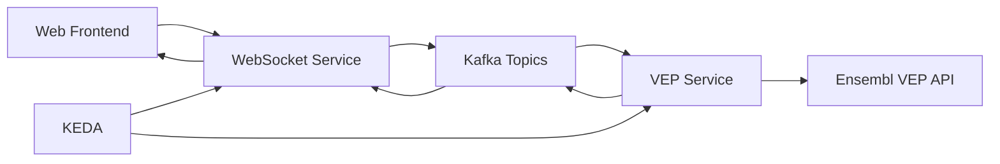

# Getting Started Tutorial - Healthcare ML Genetic Predictor

## 🎯 Learning Objectives

By the end of this tutorial, you will:
- ✅ Understand the system architecture and components
- ✅ Deploy the complete system to OpenShift
- ✅ Run your first genetic sequence analysis
- ✅ Observe KEDA autoscaling in action
- ✅ Monitor costs with Red Hat Insights

**⏱️ Estimated Time**: 45-60 minutes  
**👥 Audience**: Developers new to the system  
**📋 Prerequisites**: OpenShift cluster access, basic Kubernetes knowledge

## 🏗️ System Architecture Overview

The Healthcare ML Genetic Predictor is an event-driven system that processes genetic sequences in real-time:



### Key Components You'll Deploy

1. **🌐 Quarkus WebSocket Service**: Handles real-time communication with the frontend
2. **🔬 VEP Annotation Service**: Processes genetic sequences using the Ensembl VEP API
3. **📊 Apache Kafka**: Event streaming backbone with three scaling modes
4. **⚡ KEDA**: Kubernetes Event-driven Autoscaling for pod and node scaling
5. **💰 Red Hat Insights**: Cost management and observability

## 📋 Prerequisites Check

Before starting, ensure you have:

### Required Tools
```bash
# Check OpenShift CLI
oc version
# Should show: Client Version: 4.x.x, Server Version: 4.x.x

# Check cluster access
oc whoami
# Should show your username

# Check cluster info
oc cluster-info
# Should show cluster details
```

### Required Operators
Your OpenShift cluster needs these operators installed:
- ✅ **KEDA Operator** (for autoscaling)
- ✅ **Red Hat Integration - AMQ Streams** (for Kafka)
- ✅ **Red Hat Cost Management Metrics Operator** (for cost tracking)

## 🚀 Step 1: Clone and Explore the Repository

### Clone the Repository
```bash
# Clone the healthcare ML genetic predictor
git clone https://github.com/tosin2013/healthcare-ml-genetic-predictor.git
cd healthcare-ml-genetic-predictor

# Explore the structure
ls -la
```

### Repository Structure
```
healthcare-ml-genetic-predictor/
├── quarkus-websocket-service/    # WebSocket service (Java 17 + Quarkus)
├── vep-service/                  # VEP annotation service (Java 17 + Quarkus)
├── k8s/                          # OpenShift/Kubernetes manifests
│   ├── base/                     # Base Kustomize resources
│   └── overlays/                 # Environment-specific configs
├── scripts/                      # Deployment and testing scripts
├── notebooks/                    # Jupyter notebooks for ML analysis
└── docs/                         # Documentation (this tutorial!)
```

### Key Files to Understand
- `retrospective.md` - Complete system overview and lessons learned
- `k8s/base/` - Core Kubernetes manifests
- `scripts/test-*.sh` - Testing and validation scripts

## 🏗️ Step 2: Deploy the Infrastructure

### Create the Namespace
```bash
# Create the healthcare ML demo namespace
oc new-project healthcare-ml-demo

# Verify namespace creation
oc project
# Should show: Using project "healthcare-ml-demo"
```

### Deploy Kafka Infrastructure
```bash
# Deploy Kafka cluster and topics
oc apply -k k8s/base/infrastructure/kafka/

# Wait for Kafka cluster to be ready (this takes 3-5 minutes)
oc wait --for=condition=Ready kafka/genetic-data-cluster --timeout=300s

# Verify Kafka pods are running
oc get pods | grep kafka
# Should show kafka and zookeeper pods in Running state
```

### Verify Kafka Topics
```bash
# List Kafka topics
oc exec -it genetic-data-cluster-kafka-0 -- bin/kafka-topics.sh \
  --bootstrap-server localhost:9092 --list

# Expected topics:
# - genetic-data-raw
# - genetic-bigdata-raw  
# - genetic-nodescale-raw
# - genetic-data-annotated
```

## 🚀 Step 3: Deploy the Applications

### Deploy VEP Service
```bash
# Deploy VEP annotation service
oc apply -k k8s/base/applications/vep-service/

# Start the build (this takes 5-10 minutes)
oc start-build vep-service --follow

# Verify deployment
oc get pods | grep vep-service
# Should show vep-service pod in Running state
```

### Deploy WebSocket Service
```bash
# Deploy Quarkus WebSocket service
oc apply -k k8s/base/applications/quarkus-websocket/

# Start the build (this takes 5-10 minutes)
oc start-build quarkus-websocket-service --follow

# Verify deployment
oc get pods | grep quarkus-websocket
# Should show websocket service pods in Running state
```

## ⚡ Step 4: Deploy KEDA Autoscaling

### Deploy KEDA Scalers
```bash
# Deploy KEDA scaling configurations
oc apply -k k8s/base/keda/

# Verify KEDA scalers are created
oc get scaledobject
# Should show scalers for both services

# Check scaler status
oc describe scaledobject vep-service-scaler
oc describe scaledobject websocket-service-scaler
```

### Understanding the Scaling Modes
The system supports three scaling modes:

1. **Normal Mode** (`genetic-data-raw`): Pod scaling only
2. **Big Data Mode** (`genetic-bigdata-raw`): Memory-intensive processing  
3. **Node Scale Mode** (`genetic-nodescale-raw`): Triggers cluster autoscaler

## 🌐 Step 5: Access the Application

### Get the Application URL
```bash
# Get the route URL
oc get route quarkus-websocket-service -o jsonpath='{.spec.host}'

# Or use this command to open in browser
echo "https://$(oc get route quarkus-websocket-service -o jsonpath='{.spec.host}')"
```

### Test the WebSocket Connection
```bash
# Test the health endpoint
curl https://$(oc get route quarkus-websocket-service -o jsonpath='{.spec.host}')/q/health

# Expected response: {"status":"UP",...}
```

## 🧬 Step 6: Run Your First Genetic Analysis

### Using the Web Interface
1. Open the application URL in your browser
2. Connect to the WebSocket service
3. Enter a genetic sequence (e.g., `ATCGATCGATCG`)
4. Select "Normal Mode" for your first test
5. Click "Analyze" and watch the real-time results

### Using the API Endpoints
```bash
# Set the base URL
BASE_URL="https://$(oc get route quarkus-websocket-service -o jsonpath='{.spec.host}')"

# Test Normal Mode (Pod Scaling)
curl -X POST $BASE_URL/api/genetic/analyze/normal \
  -H "Content-Type: application/json" \
  -d '{"genetic_sequence": "ATCGATCGATCG", "session_id": "tutorial-test-1"}'

# Expected response: {"status":"processing","session_id":"tutorial-test-1",...}
```

## 📊 Step 7: Observe Scaling in Action

### Monitor Pod Scaling
```bash
# Watch pods scale up and down
watch oc get pods

# In another terminal, generate load
for i in {1..10}; do
  curl -X POST $BASE_URL/api/genetic/analyze/normal \
    -H "Content-Type: application/json" \
    -d "{\"genetic_sequence\": \"ATCGATCGATCG\", \"session_id\": \"load-test-$i\"}"
  sleep 2
done
```

### Check KEDA Scaling Metrics
```bash
# Check HPA status (created by KEDA)
oc get hpa

# Check scaler metrics
oc describe scaledobject vep-service-scaler | grep -A 10 "Triggers"
```

## 💰 Step 8: Monitor Costs (Optional)

### Check Cost Management Setup
```bash
# Verify cost management operator
oc get pods -n openshift-cost-management

# Check cost labels on resources
oc get pods --show-labels | grep cost-center
```

### View Cost Attribution
```bash
# Run the cost attribution script
./scripts/show-cost-attribution.sh

# This shows resource usage by cost center and project
```

## 🎉 Congratulations!

You've successfully:
- ✅ Deployed a complete healthcare ML genetic prediction system
- ✅ Processed your first genetic sequence
- ✅ Observed KEDA autoscaling in action
- ✅ Set up cost monitoring

## 🔄 Next Steps

### Explore More Features
1. **Try Big Data Mode**: Use larger genetic sequences to trigger memory scaling
2. **Test Node Scaling**: Use the node-scale endpoint to trigger cluster autoscaler
3. **Explore Notebooks**: Check out the Jupyter notebooks in `notebooks/genetic-analysis/`

### Learn More
- [Local Development Tutorial](02-local-development.md) - Set up local development
- [First Genetic Analysis Tutorial](03-first-genetic-analysis.md) - Deep dive into genetic processing
- [Scaling Demo Tutorial](04-scaling-demo.md) - Deep dive into scaling modes
- [System Architecture](../explanation/system-architecture.md) - Understand the design

### Troubleshooting
If you encounter issues:
- Check [Troubleshoot WebSocket Issues](../how-to/troubleshoot-websocket.md)
- Use [Debug Kafka Flow](../how-to/debug-kafka.md)
- Review the [API Reference](../reference/api-reference.md)

## 🧹 Cleanup (Optional)

To remove the deployment:
```bash
# Delete the project (removes everything)
oc delete project healthcare-ml-demo

# Or delete individual components
oc delete -k k8s/base/applications/
oc delete -k k8s/base/infrastructure/
```

---

**🎯 You're now ready to explore the healthcare ML genetic prediction system! The next tutorial will show you how to set up local development for contributing to the project.**
