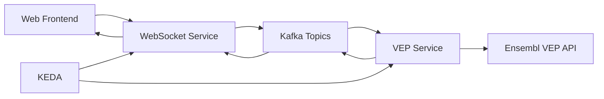

# Getting Started Tutorial - Healthcare ML Genetic Predictor

## 🎯 Learning Objectives

By the end of this tutorial, you will:
- ✅ Understand the system architecture and components
- ✅ Deploy the complete system to OpenShift
- ✅ Run your first genetic sequence analysis
- ✅ Observe KEDA autoscaling in action
- ✅ Monitor costs with Red Hat Insights

**⏱️ Estimated Time**: 45-60 minutes  
**👥 Audience**: Developers new to the system  
**📋 Prerequisites**: OpenShift cluster access, basic Kubernetes knowledge

## 🏗️ System Architecture Overview

The Healthcare ML Genetic Predictor is an event-driven system that processes genetic sequences in real-time:



### Key Components You'll Deploy

1. **🌐 Quarkus WebSocket Service**: Handles real-time communication with the frontend
2. **🔬 VEP Annotation Service**: Processes genetic sequences using the Ensembl VEP API
3. **📊 Apache Kafka**: Event streaming backbone with three scaling modes
4. **⚡ KEDA**: Kubernetes Event-driven Autoscaling for pod and node scaling
5. **💰 Red Hat Insights**: Cost management and observability

## 📋 Prerequisites Check

Before starting, ensure you have:

### Required Tools
```bash
# Check OpenShift CLI
oc version
# Should show: Client Version: 4.x.x, Server Version: 4.x.x

# Check cluster access
oc whoami
# Should show your username

# Check cluster info
oc cluster-info
# Should show cluster details
```

### Required Operators
Your OpenShift cluster needs these operators installed:
- ✅ **KEDA Operator** (for autoscaling)
- ✅ **Red Hat Integration - AMQ Streams** (for Kafka)
- ✅ **Red Hat Cost Management Metrics Operator** (for cost tracking)

## 🚀 Step 1: Clone and Explore the Repository

### Clone the Repository
```bash
# Clone the healthcare ML genetic predictor
git clone https://github.com/tosin2013/healthcare-ml-genetic-predictor.git
cd healthcare-ml-genetic-predictor

# Explore the structure
ls -la

# Make deployment scripts executable
chmod +x scripts/*.sh
```

### Repository Structure
```
healthcare-ml-genetic-predictor/
├── quarkus-websocket-service/    # WebSocket service (Java 17 + Quarkus)
├── vep-service/                  # VEP annotation service (Java 17 + Quarkus)
├── k8s/                          # OpenShift/Kubernetes manifests
│   ├── base/                     # Base Kustomize resources
│   └── overlays/                 # Environment-specific configs
├── scripts/                      # Deployment and testing scripts
├── notebooks/                    # Jupyter notebooks for ML analysis
└── docs/                         # Documentation (this tutorial!)
```

### Key Files to Understand
- `retrospective.md` - Complete system overview and lessons learned
- `k8s/base/` - Core Kubernetes manifests
- `scripts/test-*.sh` - Testing and validation scripts

## 🏗️ Step 2: Complete Enhanced Deployment

### Option A: Complete Enhanced Deployment (Recommended)
The enhanced deployment script includes ALL components from our comprehensive k8s review:

```bash
# Run the complete enhanced deployment with all missing components
./scripts/deploy-clean-enhanced.sh
```

**This enhanced script deploys:**
- ✅ All required operators (AMQ Streams, Serverless, KEDA, OpenShift AI)
- ✅ Kafka infrastructure with **corrected cluster references**
- ✅ **All 4 Kafka topics** (raw, annotated, bigdata, nodescale)
- ✅ **Node labeling** for proper workload scheduling
- ✅ WebSocket and VEP services with BuildConfigs
- ✅ **KEDA ScaledObjects** for autoscaling
- ✅ **Base kustomization resources** (previously missing)
- ✅ **OpenShift AI components** (optional)
- ✅ **Cluster Autoscaler** configuration (if permissions allow)

**⏱️ Expected Time**: 20-25 minutes

### Option B: Original Basic Deployment
For comparison, the original script (missing several components):

```bash
# Basic deployment (missing KEDA, topics, base resources, etc.)
./scripts/deploy-clean.sh
```

### Option B: Manual Step-by-Step Deployment

If you prefer to understand each step or encounter issues with the automated script:

#### Step 2.1: Install Operators
```bash
# Install required operators
oc apply -k k8s/base/operators

# Wait for operators to be ready (2-3 minutes)
sleep 180

# Verify operators are installed
oc get csv -A | grep -E "(amq-streams|serverless|keda|rhods)"
```

#### Step 2.2: Deploy Infrastructure and Topics
```bash
# Deploy namespace and Kafka cluster
oc apply -k k8s/base/infrastructure

# Wait for Kafka cluster to be ready (2-3 minutes)
oc wait --for=condition=Ready kafka/genetic-data-cluster -n healthcare-ml-demo --timeout=300s

# Deploy corrected Kafka topics (CRITICAL: topics now reference correct cluster)
oc apply -f k8s/base/kafka/topics.yaml -n healthcare-ml-demo
```

#### Step 2.3: Label Nodes (CRITICAL STEP)
```bash
# Label worker nodes for proper workload scheduling
./scripts/label-existing-nodes.sh
```

#### Step 2.4: Deploy Applications
```bash
# Deploy WebSocket service
oc apply -k k8s/base/applications/quarkus-websocket -n healthcare-ml-demo

# Deploy VEP service  
oc apply -k k8s/base/applications/vep-service -n healthcare-ml-demo

# Grant image pull permissions for VEP service
oc policy add-role-to-user system:image-puller system:serviceaccount:healthcare-ml-demo:vep-service -n healthcare-ml-demo
```

#### Step 2.5: Deploy Missing Base Resources and KEDA Scaling
```bash
# Deploy base kustomization resources (buildconfigs, scaled objects, etc.)
oc apply -k k8s/base -n healthcare-ml-demo

# Deploy KEDA scaling configurations
oc apply -k k8s/base/keda -n healthcare-ml-demo

# Deploy eventing configurations
oc apply -k k8s/base/eventing -n healthcare-ml-demo

# Verify KEDA ScaledObjects are created
oc get scaledobject -n healthcare-ml-demo
```

#### Step 2.6: Deploy OpenShift AI Components (Optional)
```bash
# Deploy OpenShift AI components if operator is ready
oc apply -k k8s/base/applications/openshift-ai -n healthcare-ml-demo
```

## 🚀 Step 3: Verify Complete Deployment

### Check All Components
```bash
# Set project context
oc project healthcare-ml-demo

# Check all pods are running
oc get pods
# Expected: Kafka pods (3), Zookeeper pods (3), WebSocket pods (2), VEP build pods

# Check builds completed successfully
oc get builds
# Expected: Both websocket and vep builds show "Complete"

# Check all Kafka topics are created
oc get kafkatopic
# Expected: genetic-data-raw, genetic-data-annotated, genetic-bigdata-raw, genetic-nodescale-raw

# Check KEDA ScaledObjects
oc get scaledobject
# Expected: Scalers for VEP and WebSocket services

# Check services and routes
oc get svc,routes
# Expected: Services and routes for websocket, vep, kafka, and zookeeper
```

### Verify Missing Components Are Now Deployed
```bash
# Check base resources are deployed
oc get buildconfig
# Expected: Build configs for both services

# Check if cluster autoscaler is configured (cluster-admin required)
oc get clusterautoscaler || echo "Cluster autoscaler requires cluster-admin permissions"

# Check OpenShift AI components (if deployed)
oc get datasciencepipeline,notebook 2>/dev/null || echo "OpenShift AI components not deployed"
```

## ⚡ Step 4: Verify KEDA Autoscaling

### Check KEDA Scalers Are Active
```bash
# Check KEDA ScaledObjects
oc get scaledobject -n healthcare-ml-demo
# Expected: vep-service-scaler and potentially websocket-service-scaler

# Check HPA created by KEDA
oc get hpa -n healthcare-ml-demo
# Expected: HPAs corresponding to ScaledObjects

# Check scaler details and triggers
oc describe scaledobject vep-service-scaler -n healthcare-ml-demo
# Expected: Kafka lag triggers configured

# Check KEDA operator is running
oc get pods -n openshift-keda | grep keda
# Expected: KEDA operator and metrics server pods running
```

### Understanding the Complete Scaling Architecture
The enhanced deployment now includes:

1. **Normal Mode** (`genetic-data-raw`): Pod scaling based on Kafka lag
2. **Big Data Mode** (`genetic-bigdata-raw`): Memory-intensive processing with higher partition count
3. **Node Scale Mode** (`genetic-nodescale-raw`): Triggers cluster autoscaler for new nodes
4. **KEDA Integration**: Event-driven autoscaling based on Kafka message lag
5. **Cluster Autoscaler**: Automatically adds/removes nodes based on demand

## 🌐 Step 5: Access the Application

### Get the Application URL
```bash
# Get the route URL
oc get route quarkus-websocket-service -n healthcare-ml-demo -o jsonpath='{.spec.host}'

# Or use this command to get the full URL
echo "https://$(oc get route quarkus-websocket-service -n healthcare-ml-demo -o jsonpath='{.spec.host}')"
```

### Test the Application Health
```bash
# Test the health endpoint
ROUTE_URL=$(oc get route quarkus-websocket-service -n healthcare-ml-demo -o jsonpath='{.spec.host}')
curl "https://$ROUTE_URL/q/health"

# Expected response: {"status":"UP",...}

# Test the WebSocket endpoint availability
curl -I "https://$ROUTE_URL/genetic-client.html"
# Expected: HTTP 200 OK
```

# Expected response: {"status":"UP",...}
```

## 🧬 Step 6: Run Your First Genetic Analysis

### Using the Web Interface
1. Get your application URL:
   ```bash
   echo "https://$(oc get route quarkus-websocket-service -n healthcare-ml-demo -o jsonpath='{.spec.host}')/genetic-client.html"
   ```
2. Open the URL in your browser
3. Connect to the WebSocket service
4. Enter a genetic sequence (e.g., `ATCGATCGATCG`)
5. Select "Normal Mode" for your first test
6. Click "Analyze" and watch the real-time results

### Using the API Endpoints
```bash
# Set the base URL
BASE_URL="https://$(oc get route quarkus-websocket-service -n healthcare-ml-demo -o jsonpath='{.spec.host}')"

# Test Normal Mode (Pod Scaling)
curl -X POST $BASE_URL/api/genetic/analyze/normal \
  -H "Content-Type: application/json" \
  -d '{"genetic_sequence": "ATCGATCGATCG", "session_id": "tutorial-test-1"}'

# Expected response: {"status":"processing","session_id":"tutorial-test-1",...}
```

### Troubleshooting Access Issues
If you can't access the application:
```bash
# Check if pods are running
oc get pods -n healthcare-ml-demo | grep websocket

# Check route status
oc get route -n healthcare-ml-demo

# Check logs for issues
oc logs -f deployment/quarkus-websocket-service -n healthcare-ml-demo
```

## 📊 Step 7: Observe Scaling in Action

### Monitor Pod Scaling
```bash
# Watch pods scale up and down
watch oc get pods -n healthcare-ml-demo

# In another terminal, generate load
BASE_URL="https://$(oc get route quarkus-websocket-service -n healthcare-ml-demo -o jsonpath='{.spec.host}')"
for i in {1..10}; do
  curl -X POST $BASE_URL/api/genetic/analyze/normal \
    -H "Content-Type: application/json" \
    -d "{\"genetic_sequence\": \"ATCGATCGATCG\", \"session_id\": \"load-test-$i\"}"
  sleep 2
done
```

### Check KEDA Scaling Metrics (If Deployed)
```bash
# Check HPA status (created by KEDA, if available)
oc get hpa -n healthcare-ml-demo

# Check scaler metrics (if KEDA is deployed)
oc describe scaledobject vep-service-scaler -n healthcare-ml-demo 2>/dev/null | grep -A 10 "Triggers" || echo "KEDA scaling not configured - this is normal for basic deployment"
```

### Understanding Current Deployment Status
After running the deployment script, you should have:
- ✅ WebSocket service running (2 replicas)
- ✅ Kafka cluster operational (3 brokers, 3 zookeepers)
- ✅ VEP service built (but may scale to zero)
- ⚠️ KEDA scaling (optional, may not be active initially)

## 💰 Step 8: Monitor Costs (Optional)

### Check Cost Management Setup
```bash
# Verify cost management operator
oc get pods -n openshift-cost-management

# Check cost labels on resources
oc get pods --show-labels | grep cost-center
```

### View Cost Attribution
```bash
# Run the cost attribution script
./scripts/show-cost-attribution.sh

# This shows resource usage by cost center and project
```

## 🎉 Congratulations!

You've successfully:
- ✅ Deployed a complete healthcare ML genetic prediction system
- ✅ Processed your first genetic sequence
- ✅ Set up the infrastructure for autoscaling
- ✅ Configured cost monitoring

## 🚨 Troubleshooting Common Issues

### Issue 1: Pods Stuck in Pending State
**Symptoms**: Pods show "Pending" status and don't start
**Solution**: 
```bash
# Check if nodes are properly labeled
oc get nodes --show-labels | grep workload-type

# If no labels found, run the node labeling script
./scripts/label-existing-nodes.sh
```

### Issue 2: Build Failures
**Symptoms**: Builds fail or take too long
**Solution**:
```bash
# Check build logs
oc logs -f bc/quarkus-websocket-service -n healthcare-ml-demo
oc logs -f bc/vep-service -n healthcare-ml-demo

# Restart failed builds
oc start-build quarkus-websocket-service -n healthcare-ml-demo
oc start-build vep-service -n healthcare-ml-demo
```

### Issue 3: Operators Not Installing
**Symptoms**: CRD errors during operator deployment
**Solution**:
```bash
# Wait for operators to fully install
sleep 180

# Check operator status
oc get csv -A | grep -E "(amq-streams|serverless|keda|rhods)"

# Retry operator configuration
oc apply -k k8s/base/operators
```

### Issue 5: Missing Kafka Topics
**Symptoms**: Topics not found, wrong cluster references
**Solution**:
```bash
# Check topic cluster references
oc get kafkatopic -n healthcare-ml-demo -o yaml | grep "strimzi.io/cluster"

# Should show "genetic-data-cluster", not "my-cluster"
# If wrong, topics.yaml has been fixed in enhanced script

# Manually create topics if needed
oc apply -f k8s/base/kafka/topics.yaml -n healthcare-ml-demo
```

### Issue 6: KEDA ScaledObjects Not Working
**Symptoms**: No autoscaling occurring, HPA not created
**Solution**:
```bash
# Check KEDA operator status
oc get pods -n openshift-keda

# Deploy KEDA configurations
oc apply -k k8s/base/keda -n healthcare-ml-demo
oc apply -k k8s/base/eventing -n healthcare-ml-demo

# Verify ScaledObjects
oc get scaledobject -n healthcare-ml-demo
```

## 🔄 Next Steps

### Explore More Features
1. **Try Big Data Mode**: Use larger genetic sequences to trigger memory scaling
2. **Test Node Scaling**: Use the node-scale endpoint to trigger cluster autoscaler
3. **Explore Notebooks**: Check out the Jupyter notebooks in `notebooks/genetic-analysis/`

### Learn More
- [Local Development Tutorial](02-local-development.md) - Set up local development
- [First Genetic Analysis Tutorial](03-first-genetic-analysis.md) - Deep dive into genetic processing
- [Scaling Demo Tutorial](04-scaling-demo.md) - Deep dive into scaling modes
- [System Architecture](../explanation/system-architecture.md) - Understand the design

### Troubleshooting
If you encounter issues:
- Check [Troubleshoot WebSocket Issues](../how-to/troubleshoot-websocket.md)
- Use [Debug Kafka Flow](../how-to/debug-kafka.md)
- Review the [API Reference](../reference/api-reference.md)

## 🧹 Cleanup (Optional)

To remove the deployment:
```bash
# Option 1: Delete the entire project (recommended)
oc delete project healthcare-ml-demo

# Option 2: Keep project but remove applications
oc delete -k k8s/base/applications/quarkus-websocket -n healthcare-ml-demo
oc delete -k k8s/base/applications/vep-service -n healthcare-ml-demo
oc delete -k k8s/base/infrastructure -n healthcare-ml-demo

# Option 3: Clean up node labels (if needed)
# Remove the workload-type labels from nodes
oc get nodes --no-headers | grep worker | awk '{print $1}' | xargs -I {} oc label node {} workload-type-
```

---

**🎯 You're now ready to explore the healthcare ML genetic prediction system! The next tutorial will show you how to set up local development for contributing to the project.**
