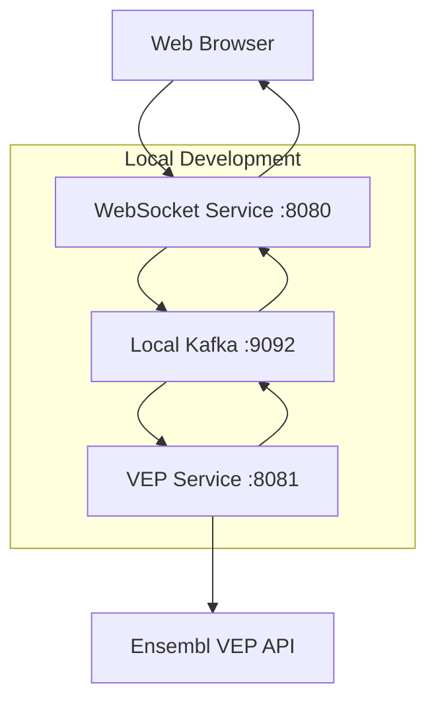

# Local Development Tutorial - Healthcare ML Genetic Predictor

## 🎯 Learning Objectives

By the end of this tutorial, you will:
- ✅ Set up a complete local development environment
- ✅ Run services locally with proper Java 17 configuration
- ✅ Test WebSocket and Kafka integration locally
- ✅ Debug and validate threading behavior
- ✅ Prepare changes for OpenShift deployment

**⏱️ Estimated Time**: 30-45 minutes  
**👥 Audience**: Developers contributing to the project  
**📋 Prerequisites**: Java 17, Podman, basic Maven knowledge

## 🛠️ Development Environment Setup

### Required Tools

#### Java 17 (Hard Requirement)
```bash
# Check Java version
java -version
# Must show: openjdk version "17.x.x"

# If not Java 17, install it:
# On RHEL/CentOS/Fedora:
sudo dnf install java-17-openjdk-devel

# On Ubuntu/Debian:
sudo apt install openjdk-17-jdk

# Set JAVA_HOME
export JAVA_HOME=/usr/lib/jvm/java-17-openjdk
```

#### Podman (Preferred over Docker)
```bash
# Install Podman
# On RHEL/CentOS/Fedora:
sudo dnf install podman

# On Ubuntu/Debian:
sudo apt install podman

# Verify installation
podman --version
```

#### Maven (Use Project Wrapper)
```bash
# The project includes Maven wrapper - use it instead of system Maven
cd healthcare-ml-genetic-predictor

# Verify wrapper works
./quarkus-websocket-service/mvnw --version
./vep-service/mvnw --version
# Both should show Maven 3.x.x with Java 17
```

## 🏗️ Local Architecture

When developing locally, you'll run:
- **Kafka**: Using Podman Compose
- **VEP Service**: Local Quarkus dev mode
- **WebSocket Service**: Local Quarkus dev mode
- **Frontend**: Served by WebSocket service



## 🚀 Step 1: Clone and Setup Repository

### Clone Repository
```bash
git clone https://github.com/tosin2013/healthcare-ml-genetic-predictor.git
cd healthcare-ml-genetic-predictor

# Initialize git in service directories (user preference)
cd quarkus-websocket-service && git init && cd ..
cd vep-service && git init && cd ..
```

### Explore Development Structure
```bash
# Key development files
ls -la quarkus-websocket-service/
# - mvnw (Maven wrapper)
# - pom.xml (Maven configuration)
# - src/main/java/ (Java source code)
# - src/main/resources/application.properties (Configuration)

ls -la vep-service/
# - mvnw (Maven wrapper)  
# - pom.xml (Maven configuration)
# - src/main/java/ (Java source code)
# - src/main/resources/application.properties (Configuration)
```

## 🐳 Step 2: Start Local Kafka

### Using Podman Compose
```bash
# Start Kafka using the provided compose file
podman-compose -f podman-compose.test.yml up -d

# Verify Kafka is running
podman ps
# Should show kafka and zookeeper containers

# Check Kafka logs
podman logs healthcare-ml-genetic-predictor_kafka_1
```

### Create Kafka Topics
```bash
# Create required topics for local development
podman exec -it healthcare-ml-genetic-predictor_kafka_1 \
  kafka-topics.sh --create --topic genetic-data-raw \
  --bootstrap-server localhost:9092 --partitions 1 --replication-factor 1

podman exec -it healthcare-ml-genetic-predictor_kafka_1 \
  kafka-topics.sh --create --topic genetic-bigdata-raw \
  --bootstrap-server localhost:9092 --partitions 1 --replication-factor 1

podman exec -it healthcare-ml-genetic-predictor_kafka_1 \
  kafka-topics.sh --create --topic genetic-nodescale-raw \
  --bootstrap-server localhost:9092 --partitions 1 --replication-factor 1

podman exec -it healthcare-ml-genetic-predictor_kafka_1 \
  kafka-topics.sh --create --topic genetic-data-annotated \
  --bootstrap-server localhost:9092 --partitions 1 --replication-factor 1

# Verify topics created
podman exec -it healthcare-ml-genetic-predictor_kafka_1 \
  kafka-topics.sh --list --bootstrap-server localhost:9092
```

## 🔬 Step 3: Start VEP Service Locally

### Configure Local Development
```bash
cd vep-service

# Check local configuration
cat src/main/resources/application.properties | grep -E "(kafka|port)"
# Should show local Kafka configuration
```

### Start VEP Service in Dev Mode
```bash
# Start in Quarkus dev mode (hot reload enabled)
./mvnw quarkus:dev -Dquarkus.http.port=8081

# Expected output:
# - Quarkus started on port 8081
# - Kafka consumer connected
# - VEP API client configured
# - Hot reload enabled
```

### Verify VEP Service
```bash
# In another terminal, test health endpoint
curl http://localhost:8081/q/health
# Expected: {"status":"UP",...}

# Test VEP processing endpoint
curl -X POST http://localhost:8081/api/vep/process \
  -H "Content-Type: application/json" \
  -d '{"sequence": "ATCGATCG", "session_id": "local-test"}'
```

## 🌐 Step 4: Start WebSocket Service Locally

### Configure Local Development
```bash
cd quarkus-websocket-service

# Check local configuration
cat src/main/resources/application.properties | grep -E "(kafka|websocket)"
# Should show local Kafka and WebSocket configuration
```

### Start WebSocket Service in Dev Mode
```bash
# Start in Quarkus dev mode (default port 8080)
./mvnw quarkus:dev

# Expected output:
# - Quarkus started on port 8080
# - WebSocket endpoint available at /genetics
# - Kafka producers/consumers connected
# - Static resources served from src/main/resources/META-INF/resources/
```

### Verify WebSocket Service
```bash
# In another terminal, test health endpoint
curl http://localhost:8080/q/health
# Expected: {"status":"UP",...}

# Test API endpoints
curl -X POST http://localhost:8080/api/genetic/analyze/normal \
  -H "Content-Type: application/json" \
  -d '{"genetic_sequence": "ATCGATCGATCG", "session_id": "local-test-1"}'
```

## 🧪 Step 5: Test Local Integration

### End-to-End Testing
```bash
# Use the provided integration test script
./scripts/test-local-integration.sh

# This script:
# 1. Verifies all services are running
# 2. Tests API endpoints
# 3. Validates Kafka message flow
# 4. Checks WebSocket connectivity
```

### Manual WebSocket Testing
```bash
# Test WebSocket connection using Node.js script
node scripts/test-websocket-client.js

# Or use the WebSocket flow test
./scripts/test-websocket-flow.sh
```

### Kafka Message Flow Testing
```bash
# Monitor Kafka messages in real-time
podman exec -it healthcare-ml-genetic-predictor_kafka_1 \
  kafka-console-consumer.sh --bootstrap-server localhost:9092 \
  --topic genetic-data-annotated --from-beginning

# In another terminal, send test data
curl -X POST http://localhost:8080/api/genetic/analyze/normal \
  -H "Content-Type: application/json" \
  -d '{"genetic_sequence": "ATCGATCGATCG", "session_id": "kafka-test"}'

# You should see the message flow through Kafka
```

## 🔧 Step 6: Development Best Practices

### Threading Validation (Critical)
```bash
# Test threading behavior to prevent event loop blocking
cd quarkus-websocket-service
./test-threading-local.sh

# Expected output:
# ✅ All operations running on executor-thread-* (worker threads)
# ❌ No operations blocking vert.x-eventloop-thread-* (event loop)
```

### Local Testing Workflow
```bash
# 1. Make code changes
# 2. Quarkus dev mode automatically reloads
# 3. Test changes locally
./scripts/test-local-setup.sh

# 4. Validate threading (if touching REST endpoints)
cd quarkus-websocket-service && ./test-threading-local.sh

# 5. Test WebSocket integration
node scripts/test-websocket-client.js

# 6. Commit changes (selective commits preferred)
git add specific-files
git commit -m "feat: description of changes"
```

### Building for OpenShift
```bash
# Build WebSocket service
cd quarkus-websocket-service
./mvnw clean package -DskipTests

# Build VEP service  
cd ../vep-service
./mvnw clean package -DskipTests

# Build container images with Podman
cd ../quarkus-websocket-service
podman build -f Containerfile -t quarkus-websocket-service:latest .

cd ../vep-service
podman build -f Containerfile -t vep-service:latest .
```

## 🐛 Step 7: Debugging and Troubleshooting

### Common Issues and Solutions

#### Java Version Issues
```bash
# If you see "UnsupportedClassVersionError"
java -version
# Must be Java 17

# Set JAVA_HOME correctly
export JAVA_HOME=/usr/lib/jvm/java-17-openjdk
./mvnw --version
```

#### Kafka Connection Issues
```bash
# Check Kafka container status
podman ps | grep kafka

# Check Kafka logs
podman logs healthcare-ml-genetic-predictor_kafka_1

# Restart Kafka if needed
podman-compose -f podman-compose.test.yml restart kafka
```

#### WebSocket Connection Issues
```bash
# Check WebSocket endpoint configuration
curl http://localhost:8080/q/health

# Check application logs for WebSocket errors
# Look for session management and endpoint registration logs
```

#### Threading Issues
```bash
# If you see event loop blocking warnings:
# 1. Add @Blocking annotation to REST endpoints
# 2. Use Uni.createFrom().item(() -> {...}).runSubscriptionOn(Infrastructure.getDefaultExecutor())
# 3. Test with threading validation script
```

### Debug Logging
```bash
# Enable debug logging for local development
# Add to application.properties:
quarkus.log.category."com.redhat.healthcare".level=DEBUG

# Or set environment variable:
export QUARKUS_LOG_CATEGORY_COM_REDHAT_HEALTHCARE_LEVEL=DEBUG
```

## 🚀 Step 8: Prepare for OpenShift Deployment

### Validate Local Changes
```bash
# Run comprehensive local tests
./scripts/test-local-integration.sh
./scripts/test-websocket-kafka-integration.js

# Validate threading behavior
cd quarkus-websocket-service && ./test-threading-local.sh
cd ../vep-service && java TestThreadingSimple.java
```

### Build and Test Containers
```bash
# Build container images
cd quarkus-websocket-service
podman build -f Containerfile -t quarkus-websocket-service:test .

cd ../vep-service  
podman build -f Containerfile -t vep-service:test .

# Test containers locally
podman run -p 8080:8080 quarkus-websocket-service:test
podman run -p 8081:8080 vep-service:test
```

### Deploy to OpenShift
```bash
# Push changes to git
git add .
git commit -m "feat: local development changes"
git push origin main

# Deploy to OpenShift using BuildConfigs
oc start-build quarkus-websocket-service -n healthcare-ml-demo
oc start-build vep-service -n healthcare-ml-demo

# Monitor builds
oc logs -f bc/quarkus-websocket-service
oc logs -f bc/vep-service
```

## 🎉 Congratulations!

You've successfully:
- ✅ Set up a complete local development environment
- ✅ Configured Java 17 and Maven wrapper usage
- ✅ Started all services locally with Kafka integration
- ✅ Validated threading behavior and WebSocket connectivity
- ✅ Prepared changes for OpenShift deployment

## 🔄 Next Steps

### Advanced Development
1. **Explore ML Notebooks**: Check out `notebooks/genetic-analysis/`
2. **Add New Features**: Follow the established patterns
3. **Performance Testing**: Use the load generation scripts

### Learn More
- [First Genetic Analysis Tutorial](03-first-genetic-analysis.md) - Deep dive into genetic processing
- [Scaling Demo Tutorial](04-scaling-demo.md) - Understand scaling modes
- [API Reference](../reference/api-reference.md) - Complete API documentation

## 🧹 Cleanup

```bash
# Stop local services (Ctrl+C in dev mode terminals)

# Stop Kafka
podman-compose -f podman-compose.test.yml down

# Clean build artifacts
cd quarkus-websocket-service && ./mvnw clean
cd ../vep-service && ./mvnw clean
```

---

**🎯 You're now ready for productive local development! The next tutorial will guide you through running your first genetic analysis in detail.**
