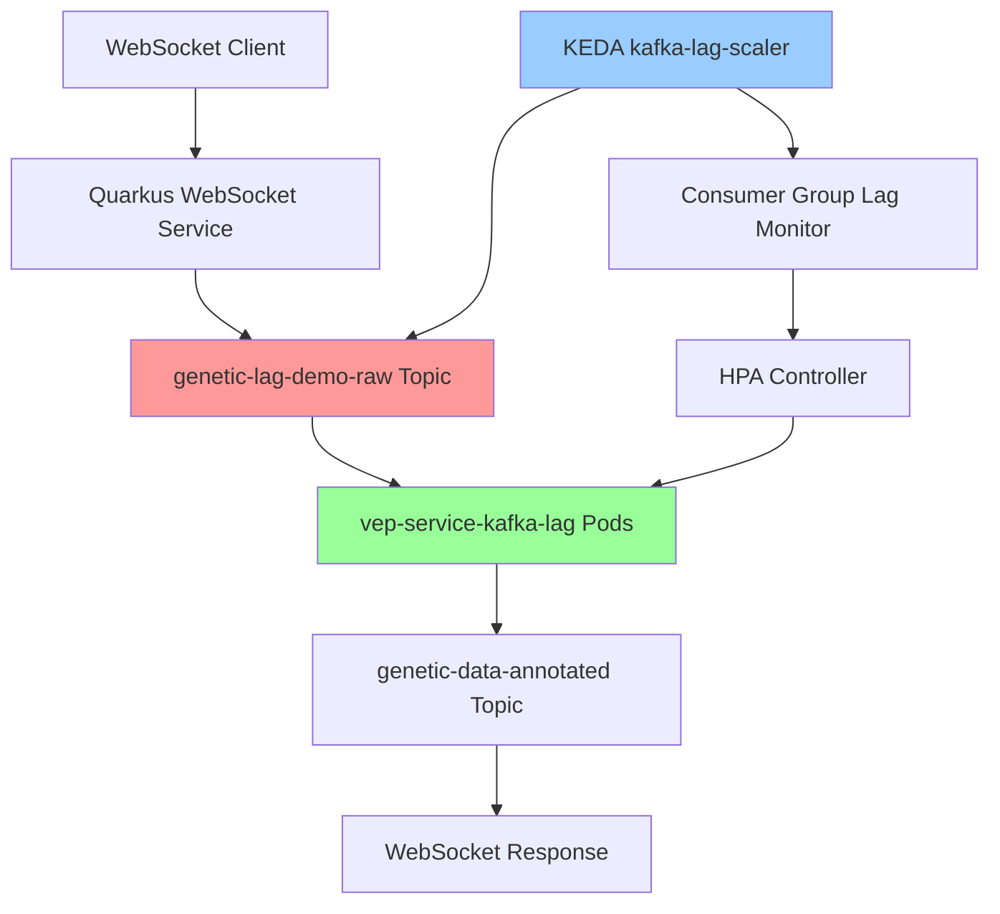

# Tutorial 5: Kafka Lag-Based Scaling with KEDA

## Overview

This tutorial demonstrates **event-driven scaling** using KEDA's Kafka consumer lag monitoring. Unlike CPU/memory-based scaling, this approach scales pods based on the **number of unprocessed messages** in Kafka topics, providing responsive scaling for message-driven workloads.

**🔑 Key Concept**: Scaling is triggered by **consumer lag** (message count), NOT by message size or genetic sequence length. A batch of 15 small messages will trigger scaling, but a single large message will not.

## What You'll Learn

- **Consumer Lag Scaling**: How KEDA monitors Kafka consumer group lag
- **Event-Driven Architecture**: Scaling based on message queue depth vs resource utilization
- **Scale-to-Zero**: Automatic scaling down to 0 pods when no messages are pending
- **Lag Thresholds**: Configuring scaling triggers based on message backlog

## Prerequisites

- Completed [Tutorial 1: Basic Setup](01-basic-setup.md)
- OpenShift cluster with KEDA operator installed
- Kafka cluster running in `healthcare-ml-demo` namespace

## Architecture Overview



## Key Components

### 1. Kafka Topic Configuration

The `genetic-lag-demo-raw` topic is optimized for lag demonstration:

```yaml
apiVersion: kafka.strimzi.io/v1beta2
kind: KafkaTopic
metadata:
  name: genetic-lag-demo-raw
  namespace: healthcare-ml-demo
spec:
  partitions: 3
  replicas: 3
  config:
    retention.ms: 3600000  # 1 hour retention
    segment.ms: 300000     # 5 minute segments for faster lag detection
```

### 2. KEDA ScaledObject

The `kafka-lag-scaler` monitors consumer group lag:

```yaml
apiVersion: keda.sh/v1alpha1
kind: ScaledObject
metadata:
  name: kafka-lag-scaler
  namespace: healthcare-ml-demo
spec:
  scaleTargetRef:
    name: vep-service-kafka-lag
  minReplicaCount: 0  # Scale to zero when no lag
  maxReplicaCount: 10
  triggers:
  - type: kafka
    metadata:
      bootstrapServers: genetic-data-cluster-kafka-bootstrap:9092
      consumerGroup: genetic-lag-consumer-group
      topic: genetic-lag-demo-raw
      lagThreshold: '10'  # Scale up when 10+ messages are lagging
```

### 3. VEP Service Consumer

The `vep-service-kafka-lag` deployment processes messages with controlled delays:

```java
@Incoming("genetic-lag-demo-raw")
@Outgoing("genetic-data-annotated")
public Uni<String> processKafkaLagGeneticSequence(String cloudEventJson) {
    return processGeneticSequenceInternal(cloudEventJson, "kafka-lag")
        .onItem().delayIt().by(Duration.ofSeconds(5))  // Controlled delay for lag demo
        .onItem().invoke(result -> {
            LOG.infof("🔄 KAFKA LAG: Allowing 5 seconds for controlled lag demonstration");
        });
}
```

## Step-by-Step Demo

### Step 1: Verify Initial State

Check that the system is scaled to zero:

```bash
# Check VEP service pods (should be 0)
oc get deployment vep-service-kafka-lag -n healthcare-ml-demo

# Check KEDA scaler status
oc get scaledobject kafka-lag-scaler -n healthcare-ml-demo

# Verify consumer group has no lag
oc exec genetic-data-cluster-kafka-0 -n healthcare-ml-demo -- \
  bin/kafka-consumer-groups.sh --bootstrap-server localhost:9092 \
  --describe --group genetic-lag-consumer-group
```

**Expected Output:**
```
NAME                    READY   UP-TO-DATE   AVAILABLE   AGE
vep-service-kafka-lag   0/0     0            0           1h

NAME               SCALETARGETKIND      SCALETARGETNAME         MIN   MAX   TRIGGERS   READY   ACTIVE
kafka-lag-scaler   apps/v1.Deployment   vep-service-kafka-lag   0     10    kafka      True    False

Consumer group 'genetic-lag-consumer-group' has no active members.
```

### Step 2: Set Kafka Lag Mode

Configure the system for lag-based scaling:

```bash
curl -X POST https://quarkus-websocket-service-healthcare-ml-demo.apps.b9892ub1.eastus.aroapp.io/api/scaling/mode \
  -H "Content-Type: application/json" \
  -d '{"mode": "kafka-lag", "description": "Consumer lag scaling demonstration"}'
```

**Expected Response:**
```json
{
  "message": "🔄 Kafka Lag Mode activated - consumer lag scaling demonstration",
  "data": {"mode": "kafka-lag"},
  "metadata": {"expectedScaling": "0→10+ pods (consumer lag-based)"}
}
```

### Step 3: Generate Test Data for Lag Demonstration

**Important**: To trigger Kafka lag scaling, you need **multiple messages**, not large messages.

```bash
# Generate 1KB sequence for each message (appropriate size)
node scripts/generate-genetic-sequence.js kafka-lag --save kafka-lag-sequence.txt

# View sequence information
ls -lh kafka-lag-sequence.txt
head -c 100 kafka-lag-sequence.txt
```

**Scaling Trigger Logic:**
- ✅ **15 messages × 1KB each** = 15 message lag → **Triggers scaling** (15 > 10 threshold)
- ❌ **1 message × 1MB** = 1 message lag → **No scaling** (1 < 10 threshold)

### Step 4: Trigger Kafka Lag Demo

#### Option A: Using WebSocket Client (Recommended)

**Single Message Test (Will NOT trigger scaling):**
```bash
# Single message = 1 lag (< 10 threshold) = No scaling
node scripts/test-websocket-client.js kafka-lag --generate 120
```

**Batch Message Test (WILL trigger scaling):**
```bash
# Send 15 messages rapidly to create lag > 10 threshold
for i in {1..15}; do
  echo "Sending message $i/15..."
  SEQUENCE=$(node scripts/generate-genetic-sequence.js kafka-lag)
  node scripts/test-websocket-client.js kafka-lag "$SEQUENCE" 10 &
  sleep 0.1  # Small delay between sends
done
```

#### Option B: Using Web UI

1. Open: https://quarkus-websocket-service-healthcare-ml-demo.apps.b9892ub1.eastus.aroapp.io/genetic-client.html
2. Select: "🔄 Kafka Lag Mode (KEDA Consumer Lag)"
3. Click: "🔄 Trigger Kafka Lag Demo"

**Note**: The UI trigger button should send **multiple messages in batch** to create sufficient consumer lag. If it only sends a single message, scaling will not occur.

### Step 5: Monitor Scaling Behavior

Open multiple terminals to monitor the scaling process:

**Terminal 1: Watch Pod Scaling**
```bash
watch 'oc get pods -l app=vep-service,mode=kafka-lag -n healthcare-ml-demo'
```

**Terminal 2: Monitor Consumer Lag**
```bash
watch 'oc exec genetic-data-cluster-kafka-0 -n healthcare-ml-demo -- \
  bin/kafka-consumer-groups.sh --bootstrap-server localhost:9092 \
  --describe --group genetic-lag-consumer-group'
```

**Terminal 3: Watch KEDA Scaler**
```bash
watch 'oc get scaledobject kafka-lag-scaler -n healthcare-ml-demo'
```

**Terminal 4: Monitor HPA**
```bash
watch 'oc get hpa kafka-lag-demo-hpa -n healthcare-ml-demo'
```

## Expected Scaling Timeline

### Phase 1: Message Accumulation (0-15 seconds)
**Batch of 15 messages sent rapidly:**
```
CONSUMER GROUP LAG:
genetic-lag-consumer-group genetic-lag-demo-raw 0    0    15   15
genetic-lag-consumer-group genetic-lag-demo-raw 1    0    12   12
genetic-lag-consumer-group genetic-lag-demo-raw 2    0    13   13

Total Lag: 40 messages (exceeds 10 message threshold)
PODS: 0/0 (no consumers running)
KEDA: Ready=True, Active=False
```

### Phase 2: KEDA Scaling Trigger (15-30 seconds)
```
CONSUMER GROUP LAG:
Total lag: 40 messages (exceeds threshold of 10)

PODS: 0/3 (scaling up)
KEDA: Ready=True, Active=True
HPA: 40/10 (current/target lag)
```

### Phase 3: Pod Startup (30-60 seconds)
```
PODS: 3/3 (running)
vep-service-kafka-lag-7b8c9d5f4-abc12   1/1     Running   0          45s
vep-service-kafka-lag-7b8c9d5f4-def34   1/1     Running   0          45s
vep-service-kafka-lag-7b8c9d5f4-ghi56   1/1     Running   0          30s
```

### Phase 4: Message Processing (60-120 seconds)
```
CONSUMER GROUP LAG:
genetic-lag-consumer-group genetic-lag-demo-raw 0    15   15   0
genetic-lag-consumer-group genetic-lag-demo-raw 1    12   12   0
genetic-lag-consumer-group genetic-lag-demo-raw 2    13   13   0

PROCESSING: Messages being consumed and processed
```

### Phase 5: Scale Down (120-180 seconds)
```
CONSUMER GROUP LAG: 0 (all messages processed)
PODS: 0/0 (scaled back to zero)
KEDA: Ready=True, Active=False
```

## Key Differences from Other Scaling Modes

| **Aspect** | **CPU/Memory Scaling** | **Kafka Lag Scaling** |
|------------|------------------------|------------------------|
| **Trigger** | Resource utilization | Message queue depth |
| **Response Time** | 30-60 seconds | 15-30 seconds |
| **Scale to Zero** | No | Yes |
| **Scaling Metric** | CPU/Memory % | Message count |
| **Use Case** | Compute-intensive | Event-driven |
| **Predictability** | Resource-based | Workload-based |

## Troubleshooting

### No Scaling Observed

**Most Common Issue: Insufficient Message Count**

1. **Check Consumer Lag (Most Important):**
```bash
oc exec genetic-data-cluster-kafka-0 -n healthcare-ml-demo -- \
  bin/kafka-consumer-groups.sh --bootstrap-server localhost:9092 \
  --describe --group genetic-lag-consumer-group
```

**Expected for Scaling**: Total lag > 10 messages
**Common Problem**: Only 1-2 messages sent (lag < 10 threshold)

2. **Verify Message Count in Topic:**
```bash
oc exec genetic-data-cluster-kafka-0 -n healthcare-ml-demo -- \
  bin/kafka-console-consumer.sh --bootstrap-server localhost:9092 \
  --topic genetic-lag-demo-raw --from-beginning --max-messages 20
```

3. **Check KEDA Scaler Status:**
```bash
oc describe scaledobject kafka-lag-scaler -n healthcare-ml-demo
```

**Fix**: Send multiple messages in batch:
```bash
# Send 15 messages to guarantee scaling
for i in {1..15}; do
  SEQUENCE=$(node scripts/generate-genetic-sequence.js kafka-lag)
  # Send via your preferred method (WebSocket/API)
done
```

### Scaling Too Aggressive

Adjust the lag threshold in the ScaledObject:

```yaml
triggers:
- type: kafka
  metadata:
    lagThreshold: '20'  # Increase threshold for less sensitive scaling
```

### Messages Not Being Consumed

1. **Check VEP Service Logs:**
```bash
oc logs -f deployment/vep-service-kafka-lag -n healthcare-ml-demo
```

2. **Verify Consumer Configuration:**
```bash
oc exec deployment/vep-service-kafka-lag -n healthcare-ml-demo -- \
  env | grep -i kafka
```

## Advanced Testing

### Batch Load Testing

**Correct Approach - Generate sustained lag for extended scaling demonstration:**

```bash
# Send 20 messages rapidly to create sustained lag
echo "🔄 Creating sustained consumer lag with 20 messages..."
for i in {1..20}; do
  SEQUENCE=$(node scripts/generate-genetic-sequence.js kafka-lag)
  echo "📤 Sending message $i/20 (1KB each)..."
  node scripts/test-websocket-client.js kafka-lag "$SEQUENCE" 5 &
  sleep 0.2  # Send faster than processing (5s delay per message)
done

echo "⏳ Waiting for lag accumulation..."
sleep 5

# Check consumer lag
echo "📊 Checking consumer lag:"
oc exec genetic-data-cluster-kafka-0 -n healthcare-ml-demo -- \
  bin/kafka-consumer-groups.sh --bootstrap-server localhost:9092 \
  --describe --group genetic-lag-consumer-group
```

**Expected Result**: 20 message lag → Triggers aggressive scaling

### Performance Validation

Use the comprehensive test script:

```bash
# Test only Kafka lag mode
scripts/test-all-scaling-modes.sh --mode kafka-lag

# Quick test with shorter timeouts
scripts/test-all-scaling-modes.sh --mode kafka-lag --quick
```

## Success Criteria

✅ **Scaling Behavior:**
- Pods scale from 0 to 3+ when lag exceeds threshold
- Pods scale back to 0 when lag is cleared
- Scaling response time < 30 seconds

✅ **Message Processing:**
- All messages are consumed and processed
- VEP annotation results are returned via WebSocket
- No message loss during scaling events

✅ **KEDA Integration:**
- ScaledObject shows Active=True during scaling
- HPA metrics reflect actual consumer lag
- Scaling events logged in KEDA operator

## Next Steps

- **Tutorial 6**: [Cost Management and Monitoring](06-cost-management.md)
- **Advanced**: [Multi-Topic Lag Scaling](advanced/multi-topic-scaling.md)
- **Integration**: [OpenShift AI with Event-Driven Scaling](advanced/ai-event-driven.md)

## Summary

Kafka lag-based scaling provides **event-driven autoscaling** that responds to actual workload demand rather than resource utilization. This approach is ideal for:

- **Message-driven architectures**
- **Batch processing workloads**
- **Cost-optimized scaling** (scale-to-zero capability)
- **Responsive scaling** based on actual work queue depth

The Healthcare ML system now supports **four distinct scaling patterns**, each optimized for different use cases and demonstrating the flexibility of modern cloud-native architectures.
