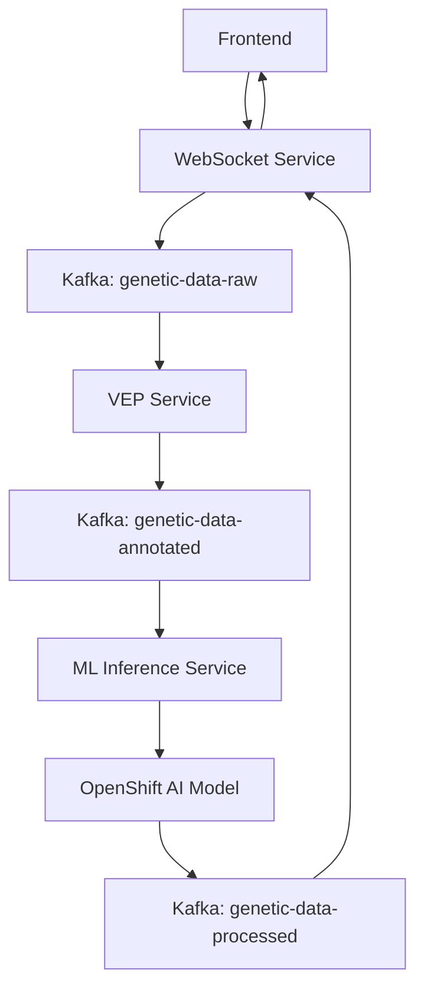

# Enhanced Healthcare ML Infrastructure Summary

## 🎯 Overview

This document summarizes the enhanced k8s directory structure with **VEP Service Extraction** and **OpenShift AI Integration** for the Healthcare ML Genetic Predictor demo.

## 🏗️ Architecture Updates

### **Phase 1: VEP Service Extraction**
- **Separated VEP functionality** into independent microservice
- **Independent scaling** with dedicated KEDA scaler
- **Kafka-based communication** between services
- **Cost attribution** per service component

### **Phase 2: OpenShift AI Integration**
- **Jupyter Notebook** for ML model development
- **Model serving** with KServe/ModelMesh
- **Inference services** with auto-scaling
- **Data science project** management

## 📁 Updated Directory Structure

```
k8s/
├── base/
│   ├── applications/
│   │   ├── quarkus-websocket/     # Main WebSocket service
│   │   ├── vep-service/           # 🆕 VEP annotation service
│   │   ├── ml-inference/          # ML inference service
│   │   ├── openshift-ai/          # 🆕 OpenShift AI components
│   │   └── frontend/              # Frontend application
│   ├── eventing/
│   │   ├── kafka-source/          # Kafka event sources
│   │   ├── keda-scaler/           # Original KEDA scalers
│   │   └── vep-keda-scaler.yaml   # 🆕 VEP-specific scalers
│   └── infrastructure/            # Kafka, operators, etc.
├── overlays/
│   └── dev/                       # Development environment
├── deploy-enhanced-infrastructure.sh    # 🆕 Enhanced deployment script
├── validate-enhanced-infrastructure.sh  # 🆕 Validation script
└── ENHANCED-INFRASTRUCTURE-SUMMARY.md   # This document
```

## 🔧 New Components

### **VEP Service (`k8s/base/applications/vep-service/`)**
- **Knative Service**: Serverless VEP annotation processing
- **BuildConfig**: Automated builds from git repository
- **ConfigMap**: VEP API configuration and Kafka settings
- **KEDA Scaler**: Independent scaling based on Kafka queue depth
- **Service Account**: Security and RBAC configuration

### **OpenShift AI (`k8s/base/applications/openshift-ai/`)**
- **Data Science Project**: Project management and resource quotas
- **Notebook Server**: Jupyter environment for ML development
- **Model Server**: KServe inference service for genetic risk prediction
- **Inference Service**: Serverless ML model serving
- **Storage**: PVCs for workspace, data, and models

### **Enhanced KEDA Scaling (`k8s/base/eventing/vep-keda-scaler.yaml`)**
- **VEP Service Scaler**: 0-20 pods based on Kafka lag
- **ML Model Scaler**: 0-10 pods for inference workload
- **Multi-trigger Scaling**: Kafka, CPU, memory, and Prometheus metrics
- **Cost Optimization**: Scale-to-zero with burst capabilities

## 🚀 Deployment Process

### **1. Enhanced Deployment Script**
```bash
./k8s/deploy-enhanced-infrastructure.sh
```

**Features:**
- ✅ **Phase-based deployment** (operators → infrastructure → applications → eventing)
- ✅ **Prerequisite checking** (oc, kustomize, cluster access)
- ✅ **Operator validation** (AMQ Streams, Serverless, KEDA, OpenShift AI)
- ✅ **Resource monitoring** and status checking
- ✅ **Cost management** label application

### **2. Validation Script**
```bash
./k8s/validate-enhanced-infrastructure.sh
```

**Validates:**
- ✅ **Operator readiness** (all required operators)
- ✅ **Infrastructure health** (Kafka cluster, topics)
- ✅ **Application status** (WebSocket, VEP, ML services)
- ✅ **OpenShift AI** (notebooks, inference services, storage)
- ✅ **KEDA scalers** (all scaling configurations)
- ✅ **Cost management** (billing labels and annotations)

## 🎯 Multi-Tier Scaling Demonstration

### **Tier 1: Pod Scaling (Normal Mode)**
- **WebSocket Service**: 1-10 pods via KEDA
- **VEP Service**: 0-20 pods based on annotation queue
- **ML Inference**: 0-10 pods for prediction workload

### **Tier 2: Node Scaling (Big Data Mode)**
- **Large sequence processing** triggers memory-intensive workloads
- **Cluster autoscaler** provisions additional nodes
- **Cost escalation** demonstration with real-time monitoring

### **Tier 3: OpenShift AI Scaling**
- **Model serving** scales based on inference requests
- **Jupyter notebooks** for development workloads
- **GPU scaling** (when GPU nodes available)

## 💰 Cost Management Integration

### **Chargeback Labels Applied:**
- `insights.openshift.io/billing-model: chargeback`
- `insights.openshift.io/cost-center: genomics-research`
- `insights.openshift.io/project: [service-specific]`

### **Cost Attribution:**
- **VEP Service**: `vep-annotation-v1`
- **ML Models**: `genetic-ml-v1`
- **WebSocket Service**: `risk-predictor-v1`
- **Infrastructure**: `scaling-config-v1`

## 🔄 Service Communication Flow



## 🎯 Next Steps

### **Immediate Actions:**
1. **Deploy enhanced infrastructure**: `./k8s/deploy-enhanced-infrastructure.sh`
2. **Validate deployment**: `./k8s/validate-enhanced-infrastructure.sh`
3. **Build VEP service**: `oc start-build vep-service -n healthcare-ml-demo`

### **ML Model Development:**
1. **Access Jupyter notebook** via OpenShift AI dashboard
2. **Develop genetic risk prediction model** using VEP annotations
3. **Train model** with clinical datasets
4. **Deploy to inference service** for production use

### **Testing and Validation:**
1. **Test multi-tier scaling** with big data mode
2. **Monitor cost attribution** in Red Hat Insights
3. **Validate end-to-end pipeline** with genetic sequences
4. **Performance testing** with load generation

## 🎉 Benefits Achieved

### **✅ Microservices Architecture**
- **Independent scaling** per service component
- **Fault isolation** and resilience
- **Technology diversity** (Quarkus, Python, etc.)

### **✅ Enterprise ML Pipeline**
- **OpenShift AI integration** for model lifecycle
- **Serverless inference** with auto-scaling
- **Data science workflow** with Jupyter notebooks

### **✅ Cost Optimization**
- **Scale-to-zero** for all services
- **Resource-based scaling** with KEDA
- **Real-time cost tracking** and chargeback

### **✅ Production Ready**
- **Security best practices** (RBAC, service accounts)
- **Health checks** and monitoring
- **GitOps deployment** with Kustomize

This enhanced infrastructure provides a comprehensive, production-ready platform for demonstrating multi-tier scaling, cost optimization, and enterprise ML capabilities in healthcare genomics! 🚀
